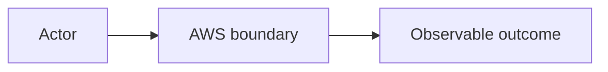

# Lesson NN — Title

> **Authoring note:** copy this file to the exact path reserved in the [syllabus](README.md). Replace every placeholder, remove authoring notes, and keep the global lesson number unchanged.

## Lesson at a glance

- **Phase:** Phase NN — Name
- **Lesson type:** conceptual / local build / manual deployment / infrastructure / delivery / capstone
- **Applicable learning-loop stages:** model / local build / manual deploy / CLI inspect / Terraform / GitHub Actions / failure recovery / teardown / retrieval
- **Estimated time:** NN–NN focused minutes
- **Prerequisite lessons:** Lesson NN — Title
- **Local requirements:** list tools, files, and tests
- **AWS services used:** list services, or “None”
- **Cost warning:** name every resource that can incur charges and when it starts/stops
- **Teardown required:** Yes/No; if yes, link to the lesson teardown and [global audit](TEARDOWN_CHECKLIST.md)

### Sequence contract

The manual AWS → CLI inspection → Terraform → GitHub Actions loop is completed across a deployment track's **track-level sequence**, not repeated in every lesson. Keep only the sections applicable to this lesson's stated outcomes:

- conceptual lessons can use a mental model, worked inspection, predictions, and retrieval without creating resources;
- local build lessons can stop before AWS;
- manual deployment lessons create and inspect resources, then tear them down unless the next lesson explicitly carries them forward;
- infrastructure lessons reproduce an already-understood deployment with Terraform; and
- delivery lessons automate an already-understood artifact and environment.

For every non-applicable part, replace the body with `Not applicable in this lesson — <reason and the lesson where it occurs>` or remove it after the authoring review. Never invent cloud resources, intentional failures, Terraform, or automation merely to fill the template.

## Why this lesson matters

State the practical problem and the operational decision the learner should be able to make afterward. Connect it to the evolving system without assuming hidden DevOps knowledge.

## Learning outcomes

By the end of this lesson, you can:

- [ ] explain the core concept in your own words;
- [ ] trace the relevant request, event, network, identity, or deployment flow;
- [ ] perform and verify the applicable lab or worked-inspection behavior;
- [ ] diagnose an intentional failure using observable evidence, when the lesson includes one; and
- [ ] identify applicable cost, security, and teardown implications, including “no cloud resources” where appropriate.

Use observable verbs. Avoid outcomes such as “understand” unless a later checkpoint proves what understanding looks like.

## Before you begin

- Complete the listed prerequisite lessons and their retrieval quizzes.
- Confirm the AWS account, profile, and region using the preflight in [Prerequisites](PREREQUISITES.md).
- Review [Cost Safety](COST_SAFETY.md).
- Start a lab note with UTC start time, profile name, account alias or masked account ID, region, lesson number, and intended resource prefix. Never record secrets or full account IDs in committed files.

### Safety gate

Do not continue until you can answer:

1. Which resources in this lesson can incur charges?
2. What event begins billing or metered usage?
3. What exact teardown proves the resource is gone?
4. Which identity will create the resources?

## Mental model

Explain the smallest accurate model first. Explicitly distinguish terms learners commonly conflate and state what the service does **not** guarantee.

### Predict before proceeding

Ask one or two prediction questions before the walkthrough. Example: “Which role is evaluated here, and what would you expect to see if its trust policy were correct but its permission policy were not?”

## Lab architecture and boundaries

Describe:

- request or event flow;
- network boundaries and exposure;
- human, deployment, and runtime identities;
- configuration and secret boundaries;
- logs, built-in metrics, and failure signals;
- mutable versus immutable artifacts; and
- resources that persist after compute stops.

## Part 1 — Build or verify locally *(when applicable)*

State the smallest local behavior to run and why it matters. Include commands, expected output patterns, and tests. Never use output that exposes tokens, parameter values, or credentials.

### Checkpoint 1 — Local evidence

- [ ] Behavior matches the stated contract.
- [ ] Tests pass.
- [ ] I can explain one failure without referring to the solution.
- **Evidence recorded:** command/output summary or test name, with secrets removed.

## Part 2 — Deploy manually once *(when applicable)*

Use the AWS Console for the minimum meaningful deployment. For each action:

1. explain why the resource exists;
2. identify its identity, network, configuration, and cost boundary;
3. use course-standard names and tags;
4. show the expected successful state; and
5. avoid convenience options that create unrelated or unexpectedly billable resources.

If the lesson is conceptual and creates no resources, replace this section with a worked inspection exercise or mark it not applicable. State that the expected cloud-resource baseline remains empty.

## Part 3 — Inspect with the AWS CLI *(when applicable)*

Use read-only commands to confirm the resource relationships independently of the Console. Include:

- the named profile and explicit region;
- expected fields rather than brittle full-output snapshots;
- an identity check before service commands; and
- a warning not to paste credentials, secret values, or signed URLs into notes.

### Checkpoint 2 — Manual deployment

- [ ] The resource reached the expected state.
- [ ] The CLI confirms the critical relationship or configuration.
- [ ] Built-in logs or metrics show the expected activity.
- [ ] I can draw the runtime and IAM flow from memory.
- **Evidence recorded:** resource identifiers masked where appropriate and a short observation.

## Part 4 — Intentional failure and diagnosis *(when applicable)*

Introduce one bounded, reversible failure. State the predicted symptom, diagnostic signals, safe recovery, and time limit. Do not use destructive failures against shared or production resources.

### Checkpoint 3 — Recovery

- [ ] I observed the predicted failure signal.
- [ ] I identified the cause from evidence rather than guesswork.
- [ ] I restored and re-verified the healthy state.
- **Evidence recorded:** redacted error, signal, root cause, and fix.

## Part 5 — Reproduce with Terraform *(when scheduled by the syllabus)*

Map each manually created concept to its Terraform resource, data source, variable, output, or external secret-seeding step. Run formatting, validation, plan, apply, inspection, a small drift exercise where safe, and destroy.

Explain:

- dependency edges and why they exist;
- what enters state and how state is protected;
- which secret values must remain outside ordinary Terraform-managed arguments;
- which outputs are intentionally non-sensitive; and
- how the Terraform teardown differs from manually deleting resources.

If Terraform is introduced in a later lesson, explicitly link forward and retain the manual resource inventory needed for that lesson.

### Checkpoint 4 — Repeatability

- [ ] The plan is explainable before apply.
- [ ] The applied behavior matches the manual deployment.
- [ ] No secret appears in source, terminal evidence, outputs, or ordinary state inputs.
- [ ] Destroy completes and the independent audit finds no remaining course resources.

## Part 6 — Automate application delivery *(when scheduled by the syllabus)*

When scheduled by the syllabus, add CI and deployment only after the manual and Terraform paths are understood. Use GitHub OIDC, restricted trust, explicit workflow permissions, immutable artifact versions, tests before deployment, and a post-deploy smoke test.

Keep infrastructure apply/destroy manual unless the lesson explicitly changes that boundary. If automation is deferred, name the future lesson and the artifact or interface it will consume.

### Checkpoint 5 — Delivery evidence

- [ ] No long-lived AWS access key is stored in GitHub.
- [ ] The workflow assumed the intended role and only the intended permissions.
- [ ] The deployed artifact is immutable and traceable to source.
- [ ] The smoke test verifies behavior, not merely workflow completion.

## Teardown and resource audit

If the lesson creates resources, list the lesson-specific deletion order, including producers or triggers that must be disabled first, then complete the [global teardown checklist](TEARDOWN_CHECKLIST.md). If it creates no resources, record `Cloud resources created: none` and do not require a fictional destroy.

- [ ] Resource creation stopped before deletion.
- [ ] Terraform-managed resources were destroyed from the correct root and state.
- [ ] Manually created resources and external secret values were deleted.
- [ ] Logs, artifacts, public IPv4 addresses, event mappings, queues, and data stores were checked.
- [ ] Billing and resource views were revisited after their documented reporting delay.

## Retrieval quiz

Answer without notes, then verify against the lesson and primary references.

1. Ask for the lesson's central distinction.
2. Ask the learner to trace an identity, request, event, or deployment flow.
3. Ask what the service guarantees and does not guarantee.
4. Ask which failure signal would distinguish two plausible causes.
5. Ask which resources can still incur cost after traffic or compute stops, or why none apply.
6. Ask how this lesson contributes to the track-level manual → CLI → Terraform → GitHub Actions sequence.

Use a collapsible answer section only after all questions:

Answer key and explanations

Provide concise answers with links back to the relevant primary references.

## Reflection

- What did the Console make easy but obscure?
- What did Terraform make explicit?
- What would you automate next, and what should remain a deliberate operation?
- Which design would change first under production security, scale, or availability requirements?

## Authoritative references

Include primary sources for security, behavior, quotas, cost, and correctness. Prefer current AWS Developer Guides, API/IAM references, pricing pages, service quotas, Well-Architected guidance, the Terraform AWS provider, and official GitHub documentation. Add an access date to change-sensitive claims. Community sources may supplement, but not replace, a primary source.

- [AWS page title](https://docs.aws.amazon.com/) — supports which claim; accessed YYYY-MM-DD.
- [AWS pricing page](https://aws.amazon.com/pricing/) — supports the cost warning; accessed YYYY-MM-DD.
- [Terraform AWS provider](https://registry.terraform.io/providers/hashicorp/aws/latest/docs) — supports resource behavior; accessed YYYY-MM-DD.
- [GitHub Actions documentation](https://docs.github.com/en/actions) — include only when relevant; accessed YYYY-MM-DD.

## Next lesson

Continue to **Lesson NN — Title** at `course/phase-NN-name/NN-title.md`. State what evidence or running state carries forward. Default to a fully torn-down AWS account unless the next lesson explicitly instructs otherwise.
