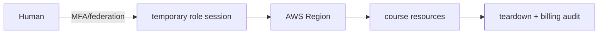

# Lesson 01 — Account Safety and Course Setup

## Lesson at a glance
- **Type/stages:** conceptual setup; model → CLI identity inspection → failure recovery → retrieval
- **Time:** 60–90 minutes
- **Prerequisites:** [Prerequisites](../PREREQUISITES.md), [Cost Safety](../COST_SAFETY.md)
- **Outcome:** establish a non-production account, temporary-credential profile, one Region, naming/tags, alerts, and a teardown habit.

> **Cost box:** This lesson creates no application resources. Budgets and alerts may send notifications but are not hard caps. Root MFA, IAM Identity Center, IAM roles, and tags generally have no direct hourly charge. Confirm current account terms. **Cloud baseline: empty.**

## Position in the track
This is the safety gate for the track-level manual → CLI → Terraform → GitHub Actions loop. It inspects identity only; manual ECS starts in Lesson 09, Terraform in 10, and delivery in 11.

## Mental model
An AWS account is a billing and security boundary. A Region selects regional endpoints; an identity determines allowed actions; tags help attribute resources but do not discover everything.



AWS secures the cloud; you secure account access, configuration, data, and resources you create. A budget reports delayed usage—it does not stop it.

## Guided setup and exercise
1. Use a dedicated learning account or approved sandbox. Enable root MFA; never create root access keys.
2. In Billing, enable available Free Tier alerts and create zero-spend/low-threshold actual and forecast alerts. Record recipients privately.
3. Choose a supported Region and prefix such as `aws-dev-nj`; set a UTC teardown reminder.
4. Configure the approved SSO profile (personal-account learners may need an administrator-guided non-root federation setup):

```bash
aws configure sso --profile aws-dev-learning
aws sso login --profile aws-dev-learning
export AWS_PROFILE="aws-dev-learning"
export AWS_REGION="us-east-1"
export AWS_DEFAULT_REGION="$AWS_REGION"
aws sts get-caller-identity --profile "$AWS_PROFILE"
aws configure get region --profile "$AWS_PROFILE"
```

Do not paste the account ID or role session into committed notes. Check that the ARN is a non-root role in the intended account and the configured Region equals `$AWS_REGION`.

### Checkpoint
- [ ] Root MFA and billing alerts are configured or owned by the sandbox administrator.
- [ ] CLI uses temporary credentials and a named profile; no root or GitHub access key exists.
- [ ] Prefix, Region, `project`, `environment`, `owner`, `managed-by`, `course-lesson`, and `expires-at` conventions are recorded.
- [ ] I can explain why alerts and tags do not replace teardown.

## Bounded failure lab — wrong Region
Time box: 5 minutes. Temporarily set `AWS_REGION=us-west-2` while the profile is configured for another Region. Predict the mismatch, run `aws configure get region`, then restore the chosen Region. Do not create anything. Evidence: the two Region strings, not identity output. If identity is unexpected, stop rather than “fixing” permissions.

## Teardown and audit
Cloud resources created: none. Log out of SSO if desired, leave protective MFA/budgets enabled, and verify the ECS/ECR/VPC/CloudWatch/SSM consoles show no course prefix. Follow the read-only portions of the [global audit](../TEARDOWN_CHECKLIST.md).

## Retrieval quiz
1. Why is a budget not a spending cap?
2. Trace human login to a regional API call.
3. Which user must never have CLI access keys?
4. What signal requires an immediate stop?
5. Why are tags insufficient for resource audit?
6. Where does this lesson sit in the deployment loop?

<details>
<summary>Answer key</summary>

1. Cost data and alerts can be delayed and do not universally stop services. 2. Human → MFA/federation → temporary role session → regional endpoint. 3. Root. 4. An unexpected account/ARN/Region. 5. Not all resources support tags and indexes lag. 6. It establishes the identity/cost boundary before any manual deployment.
</details>

## Authoritative references
- [AWS shared responsibility model](https://aws.amazon.com/compliance/shared-responsibility-model/) — account/customer boundary; accessed 2026-08-16.
- [IAM Identity Center CLI authentication](https://docs.aws.amazon.com/cli/latest/userguide/cli-configure-sso.html) — temporary CLI sessions; accessed 2026-08-16.
- [AWS Budgets](https://docs.aws.amazon.com/cost-management/latest/userguide/budgets-managing-costs.html) and [AWS Free Tier](https://aws.amazon.com/free/) — alert behavior/current offers; accessed 2026-08-16.

## Next lesson
Continue to [Lesson 02](02-iam-temporary-credentials-and-oidc.md). Carry forward the verified profile and empty cloud baseline.
