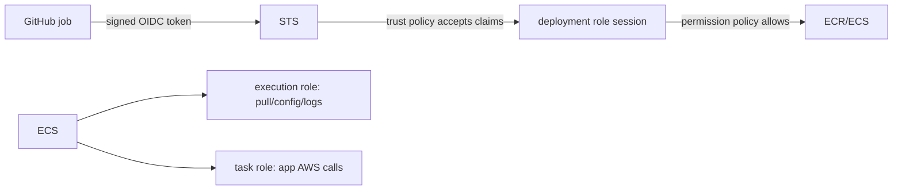

# Lesson 02 — IAM, Temporary Credentials, and OIDC

## Lesson at a glance
- **Stages/time:** model → policy inspection → bounded denial → retrieval; 75–100 minutes
- **Prerequisite:** [Lesson 01](01-account-safety-and-course-setup.md)
- **Outcomes:** distinguish users/roles/sessions, trust/permission policies, execution/task/deployment roles, and explain GitHub OIDC without access keys.

> **Cost box:** No cloud resources are required. IAM roles/policies and an OIDC provider generally have no direct hourly charge, but stale trust is a security risk. This lesson inspects examples; account OIDC setup is used by Lessons 10–11.

## Position and mental model
This lesson defines identities used by the full loop. Lesson 09 creates runtime roles manually, 10 codifies them and restricted OIDC trust, and 11 assumes the deployment role.



A trust policy answers “who may assume?”; a permission policy answers “what may the resulting identity do?” An allow in one cannot repair a denial or missing allow in the other. OIDC exchanges a short-lived signed claim for STS credentials; it is not an AWS access key.

## Worked inspection
```bash
export AWS_PROFILE="aws-dev-learning"
export AWS_REGION="us-east-1"
aws sts get-caller-identity --profile "$AWS_PROFILE"
aws configure list --profile "$AWS_PROFILE"
```

The configuration listing should show the temporary profile source; do not copy credential material into notes. Read `infra/fargate/iam.tf` and identify:
1. ECS service principal in task-role trust;
2. exact Parameter Store ARNs on the execution role;
3. GitHub `aud` and environment-scoped `sub`;
4. `iam:PassRole` restricted to the two task roles and ECS Tasks.

`ecs:RegisterTaskDefinition` is the deliberate exception to family-ARN scoping: ECS authorizes registration before the new revision exists, so the deployment statement requires `Resource: "*"`. The policy narrows that wildcard with AWS-supported request conditions: the selected Region, Fargate compatibility, `privileged=false`, 256 CPU units, and 512 MiB memory. It does not require request tags because the deployment workflow does not submit tags. `ecs:UpdateService` remains separately scoped to the exact course service ARN.

### Runnable checkpoint
```bash
terraform -chdir=infra/fargate fmt -check
terraform -chdir=infra/fargate init -backend=false
terraform -chdir=infra/fargate validate
```
- [ ] I can mark every statement as trust or permission.
- [ ] I can explain why the app task role has no permissions yet.
- [ ] I can trace GitHub token → STS session → ECR/ECS.

## Bounded failure lab — claim mismatch
Time box: 10 minutes; no apply. Copy the GitHub trust policy into private notes and change the expected environment from `ecs-dev` to `production`. Predict `AccessDenied` for an `ecs-dev` job, identify the mismatching `sub`, then discard the copy. Do not weaken the condition to a repository-wide wildcard. The diagnostic distinction is: STS assumption denial means trust/claims; a later ECR denial means session permissions.

## Teardown and audit
Cloud resources created: none. Remove private scratch policy files. Do not delete an organization-owned OIDC provider. Confirm no access key was created and run the [global audit](../TEARDOWN_CHECKLIST.md) baseline checks.

## Retrieval quiz
1. Trust policy versus permission policy?
2. Execution role versus task role?
3. Why does OIDC remove long-lived GitHub AWS keys?
4. Which claim scopes this course deployment to an environment?
5. What distinguishes trust failure from permission failure?
6. When are these identities exercised?

<details><summary>Answer key</summary>

1. Trust controls assumption; permissions control session actions. 2. ECS agent uses execution role for image/config/logs; app code uses task role. 3. STS issues expiring credentials after validating a signed token. 4. `sub=repo:OWNER/REPO:environment:ecs-dev`. 5. AssumeRoleWithWebIdentity fails before AWS service calls versus a service AccessDenied afterward. 6. Manual runtime roles in 09, Terraform/OIDC role in 10, automated deployment in 11.
</details>

## Authoritative references
- [IAM roles](https://docs.aws.amazon.com/IAM/latest/UserGuide/id_roles.html), [policy evaluation](https://docs.aws.amazon.com/IAM/latest/UserGuide/reference_policies_evaluation-logic.html) — identity and policy semantics; accessed 2026-08-16.
- [ECS task IAM roles](https://docs.aws.amazon.com/AmazonECS/latest/developerguide/task-iam-roles.html) and [execution role](https://docs.aws.amazon.com/AmazonECS/latest/developerguide/task_execution_IAM_role.html) — boundary; accessed 2026-08-16.
- [GitHub OIDC in AWS](https://docs.github.com/en/actions/how-tos/secure-your-work/security-harden-deployments/oidc-in-aws) — claims and temporary credentials; accessed 2026-08-16.

## Next lesson
Continue to [Lesson 03](03-typescript-api-fundamentals.md); keep the empty cloud baseline.
