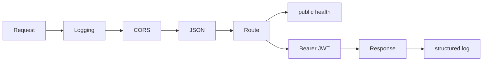

# Lesson 03 — TypeScript API Fundamentals

## Lesson at a glance
- **Stages/time:** local model → tests → failure recovery; 75–105 minutes
- **Prerequisite:** [Lesson 02](02-iam-temporary-credentials-and-oidc.md)
- **Outcomes:** trace middleware/routes, distinguish liveness/readiness, validate typed config, explain CORS versus auth, and read structured logs.

> **Cost box:** Local-only lesson; no AWS resources or public IPv4. Stop the local process when finished.

## Position and mental model
This establishes the application contract consumed by Docker in Lesson 04 and deployed manually/Terraform/GHA in Lessons 09–11. It does not pretend to deploy.



Liveness asks whether the process should be restarted; readiness asks whether it can serve traffic now. CORS tells browsers which cross-origin responses may be exposed; it does not authenticate callers. JWT signature, issuer, and audience checks establish the `/hello` identity.

## Local guided lab
Inspect `apps/ecs-api/src/app.ts`, `config.ts`, and `main.ts`, then run:

```bash
npm ci
npm test -- apps/ecs-api/test
npm run typecheck
```

Map behavior: `GET /health/live` → `200 {"status":"ok"}`; `GET /health/ready` → 200/503; unauthenticated `GET /hello` → 401. Configuration requires port, service name/version/environment, a comma-separated exact HTTPS CORS allowlist, and JWT public key/issuer/audience; errors list field names, never values.

Create a temporary RSA key locally (do not commit it), start the server, and probe:

```bash
tmp="$(mktemp -d)"; trap 'rm -rf "$tmp"' EXIT
openssl genpkey -algorithm RSA -pkeyopt rsa_keygen_bits:2048 -out "$tmp/private.pem"
openssl pkey -in "$tmp/private.pem" -pubout -out "$tmp/public.pem"
export JWT_PUBLIC_KEY_BASE64="$(base64 <"$tmp/public.pem" | tr -d '\n')"
export JWT_ISSUER="https://issuer.example.test"
export JWT_AUDIENCE="aws-course-api"
export PORT=3000
export SERVICE_NAME="ecs-api"
export SERVICE_VERSION="local"
export APP_ENVIRONMENT="local"
export CORS_ALLOWED_ORIGINS="https://learner.example"
npm run build
npm --workspace @aws-course/ecs-api start
```

In another terminal: `curl --fail http://127.0.0.1:3000/health/live` and `curl -i http://127.0.0.1:3000/hello`. Stop with Ctrl-C; do not save the private key.

### Checkpoint
- [ ] Tests/typecheck pass and liveness returns `ok`.
- [ ] `/hello` without a token is 401.
- [ ] I can trace request middleware order and identify each config field.
- [ ] Logs are JSON and do not contain credentials or parameter values.

## Bounded failure lab — missing issuer
Time box: 5 minutes. In a fresh shell with the other values present, `unset JWT_ISSUER` and start the app. Predict a fast startup failure naming `JWT_ISSUER`, observe it, restore the value, and re-run liveness. Do not “fix” this with a silent default.

## Teardown and audit
Stop Node, delete the temporary key directory, unset the lesson's JWT/service/CORS variables, and record `Cloud resources created: none`. Verify no `.env` or key file is staged.

## Retrieval quiz
1. Liveness versus readiness?
2. Why is CORS not authorization?
3. Trace `/hello`.
4. Which claims constrain a valid JWT?
5. What distinguishes bad configuration from readiness failure?
6. What does the next deployment loop preserve?

<details><summary>Answer key</summary>

1. Restart-worthiness versus ability to serve. 2. Non-browser clients ignore CORS and it proves no identity. 3. logging → CORS/JSON → bearer extraction → JWT validation → handler. 4. Signature, issuer, audience (and token time constraints). 5. Config fails process startup; readiness returns 503 from a running process. 6. Port 3000, env schema, routes, health, auth, and logs.
</details>

## Authoritative references
- [Express routing](https://expressjs.com/en/guide/routing.html), [Node environment variables](https://nodejs.org/api/environment_variables.html), and [RFC 7519](https://www.rfc-editor.org/rfc/rfc7519) — runtime/JWT contracts; accessed 2026-08-16.
- [ECS container health checks](https://docs.aws.amazon.com/AmazonECS/latest/developerguide/healthcheck.html) — later health behavior; accessed 2026-08-16.

## Next lesson
Continue to [Lesson 04](04-docker-fundamentals.md). No AWS state carries forward.
