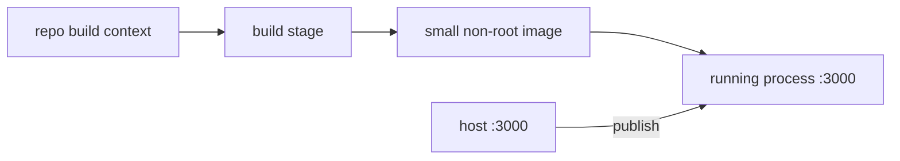

# Lesson 04 — Docker Fundamentals

## Lesson at a glance
- **Stages/time:** local build → inspect → failure recovery; 75–110 minutes
- **Prerequisite:** [Lesson 03](03-typescript-api-fundamentals.md)
- **Outcomes:** distinguish image/container/layer, explain multi-stage builds and context, map port 3000, inspect health/signals, and prepare an immutable ECR artifact.

> **Cost box:** Local Docker is not an AWS charge. This lesson does not push ECR. ECR storage/scanning and transfer can incur charges beginning in Lesson 09.

## Position and mental model
The image is the immutable handoff used by manual deployment (09), Terraform task definitions (10), and commit-SHA delivery (11). This lesson remains local.



An image is a layered template; a container is a process plus isolation. `EXPOSE 3000` documents intent but does not publish a host port. ECS `awsvpc` later gives the task its own ENI.

## Guided lab
Read `apps/ecs-api/Dockerfile`: Node 24 build stage installs workspace dependencies; runtime copies only production dependencies and output, runs as `node`, exposes 3000, and checks `/health/live`.

```bash
npm run docker:build:ecs
docker image inspect aws-course-ecs-api:local \
  --format '{{.Config.User}} {{json .Config.ExposedPorts}}'
npm run docker:smoke:ecs
docker history aws-course-ecs-api:local
```

Expected: user `node`, port `3000/tcp`, and the smoke script publishes a random loopback port and verifies live, ready, unauthenticated 401, allowed-origin CORS, and disallowed-origin CORS. No private key/config is baked in. The repository root is required build context because the Dockerfile copies workspace manifests.

For a manual run, supply the same temporary values from Lesson 03 and use `docker run --rm -p 127.0.0.1:3000:3000 ...`; bind loopback, not all interfaces. Inspect with `docker ps`, `docker inspect --format '{{json .State.Health}}' CONTAINER`, then `docker stop --time 10 CONTAINER`.

### Checkpoint
- [ ] Image builds and the automated smoke passes.
- [ ] Runtime user is non-root and only port 3000 is documented.
- [ ] I can explain build context, stages, health command, and SIGTERM stop.
- [ ] No secret or private key is in image history/environment.

## Bounded failure lab — unpublished port
Time box: 8 minutes. Run the valid image without `-p`, predict that `curl 127.0.0.1:3000` cannot reach it while `docker inspect` shows the process healthy, observe, stop, and rerun with `-p 127.0.0.1:3000:3000`. This separates application health from host network publication.

## Teardown and audit
Stop/remove containers, delete temporary keys, then optionally `docker image rm aws-course-ecs-api:local`. Record `Cloud resources created: none`; `docker ps -a --filter ancestor=aws-course-ecs-api:local` should be empty.

## Retrieval quiz
1. Image versus container?
2. Why use a multi-stage build?
3. Does `EXPOSE` publish a port?
4. What signal does `docker stop` send first?
5. What can cost after an ECS task stops?
6. How is the image versioned later?

<details><summary>Answer key</summary>

1. Immutable template versus running isolated process. 2. Keep compilers/dev dependencies out of runtime. 3. No; `-p` or ECS networking does. 4. SIGTERM, then SIGKILL after timeout. 5. ECR images and retained logs. 6. Full Git commit SHA in ECR and task definition.
</details>

## Authoritative references
- [Docker build context](https://docs.docker.com/build/concepts/context/), [multi-stage builds](https://docs.docker.com/build/building/multi-stage/), and [container networking](https://docs.docker.com/engine/network/) — build/runtime behavior; accessed 2026-08-16.
- [ECR image push](https://docs.aws.amazon.com/AmazonECR/latest/userguide/docker-push-ecr-image.html) and [ECR pricing](https://aws.amazon.com/ecr/pricing/) — later artifact/cost behavior; accessed 2026-08-16.

## Next lesson
Continue to [Lesson 05](05-aws-networking-fundamentals.md); only local evidence carries forward.
