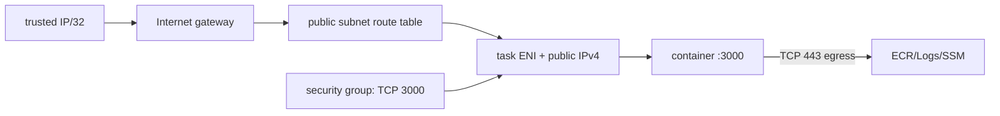

# Lesson 05 — AWS Networking Fundamentals

## Lesson at a glance
- **Stages/time:** conceptual model → worked CLI inspection → failure diagnosis; 80–110 minutes
- **Prerequisite:** [Lesson 04](04-docker-fundamentals.md)
- **Outcomes:** trace VPC/subnet/route/IGW/public-IP flow, calculate CIDR membership, compare security groups/NACLs, and justify the temporary public-task design.

> **Cost box:** No resources are created here. In Lessons 09–11, Fargate and each in-use public IPv4 can incur hourly/usage charges. NAT gateways and ALBs are deliberately absent. VPC pricing can change; verify before the lab.

## Position and mental model
This model is instantiated manually in 09 and by Terraform in 10. The GitHub workflow in 11 updates the application, not networking.



A subnet is “public” because its route table reaches an IGW; a task is internet-reachable only if it also has a public IPv4 and allows ingress. Security groups are stateful and attached to ENIs; NACLs are stateless subnet filters. Neither encrypts HTTP.

## Worked exercise
Without AWS, prove the planned addresses:

```bash
python3 - <<'PY'
import ipaddress
vpc = ipaddress.ip_network("10.42.0.0/16")
subnet = ipaddress.ip_network("10.42.1.0/24")
print(subnet.subnet_of(vpc), subnet.num_addresses)
PY
```

Read `infra/fargate/main.tf` and trace `0.0.0.0/0 → IGW`, `assign_public_ip=true`, inbound `trusted-IP/32 → TCP 3000`, and outbound TCP 443. Before later apply, determine your IP without embedding it in docs, then put only the `/32` in ignored `terraform.tfvars`.

Read-only post-deployment inspection pattern:

```bash
aws ec2 describe-route-tables --profile "$AWS_PROFILE" --region "$AWS_REGION" \
  --filters "Name=tag:Name,Values=YOUR_PREFIX-public" \
  --query 'RouteTables[0].Routes[].{destination:DestinationCidrBlock,gateway:GatewayId}'
aws ec2 describe-security-groups --profile "$AWS_PROFILE" --region "$AWS_REGION" \
  --group-ids "sg-REPLACE_AFTER_DEPLOY"
```

### Checkpoint
- [ ] I can determine whether a CIDR belongs to the VPC.
- [ ] I can list all four internet-reachability conditions.
- [ ] I can explain stateful SG return traffic and why no inbound ephemeral rule is needed.
- [ ] I can state why this short lab accepts plain HTTP only from one IP.

## Bounded failure lab — route prediction
Time box: 10 minutes; no apply. On a copy of the diagram, remove the `0.0.0.0/0` IGW route. Predict: task may start, but cannot pull ECR or send logs/SSM requests in this no-NAT/no-endpoint design; client also cannot reach it. Restore the edge. Contrast with a blocked SG ingress: image pull can succeed, but the client times out.

## Teardown and audit
Cloud resources created: none. Delete scratch diagrams containing IPs. In later labs verify task ENIs/public IPv4 are released and no NAT, endpoint, or ALB exists via the [global audit](../TEARDOWN_CHECKLIST.md).

## Retrieval quiz
1. What makes a subnet public?
2. What four conditions make the task reachable?
3. SG versus NACL?
4. Missing route versus missing ingress symptom?
5. Which network item is explicitly billable?
6. Which lesson creates this topology?

<details><summary>Answer key</summary>

1. Associated route to an IGW. 2. IGW attached, route, task public IPv4, SG allow. 3. Stateful ENI firewall versus stateless subnet filter. 4. Missing route also breaks task egress/startup; missing ingress permits startup but blocks client. 5. In-use public IPv4 (plus transfer/compute). 6. Manual 09, Terraform 10.
</details>

## Authoritative references
- [VPC internet access](https://docs.aws.amazon.com/vpc/latest/userguide/VPC_Internet_Gateway.html), [security groups](https://docs.aws.amazon.com/vpc/latest/userguide/vpc-security-groups.html), and [network ACLs](https://docs.aws.amazon.com/vpc/latest/userguide/vpc-network-acls.html) — behavior; accessed 2026-08-16.
- [VPC pricing](https://aws.amazon.com/vpc/pricing/) and [public IPv4 pricing](https://aws.amazon.com/vpc/pricing/#Public_IPv4_Address) — current cost; accessed 2026-08-16.

## Next lesson
Continue to [Lesson 06](06-terraform-fundamentals.md), retaining no cloud state.
