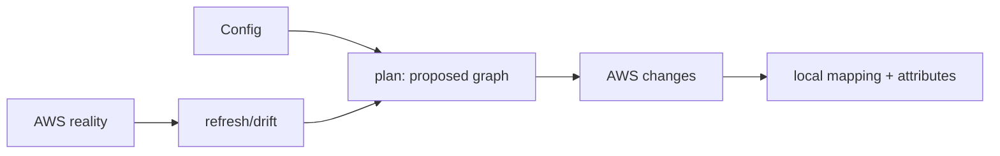

# Lesson 06 — Terraform Fundamentals

## Lesson at a glance
- **Stages/time:** model → format/validate/plan reading → bounded drift reasoning; 90–120 minutes
- **Prerequisite:** [Lesson 05](05-aws-networking-fundamentals.md)
- **Outcomes:** explain providers/resources/data/variables/outputs, read dependency graphs, protect state, and separate external secret seeding from infrastructure.

> **Cost box:** Terraform CLI/state are local, but `apply` creates billable AWS resources. This lesson runs format/validate only—never apply. Fargate, public IPv4, ECR, logs, and transfer begin only in Lesson 10 when explicitly applied.

## Position and mental model
Manual experience comes in Lesson 09; Lesson 10 uses Terraform to reproduce it. GitHub Actions in 11 deploys images but does not apply/destroy infrastructure.



State is Terraform's resource-instance mapping and cached attributes—not a password vault. Marking an output sensitive only hides display; it does not remove a value from state.

## Guided no-apply lab
```bash
cd infra/fargate
terraform fmt -check
terraform init -backend=false
terraform validate
terraform providers
```

Read `versions.tf`, `variables.tf`, `main.tf`, `iam.tf`, `ecs.tf`, and `outputs.tf`. Identify implicit edges (service → subnet/SG/task definition), explicit `depends_on` for route readiness, provider/default tags, validated inputs, and non-sensitive outputs. Confirm `.gitignore` excludes state and plans.

Parameter values are not Terraform resources or variables. `local.parameter_arns` constructs names/ARNs only; `scripts/seed-ecs-parameters.sh` supplies values directly to SSM, preventing ordinary configuration/state from containing values.

Create an ignored `terraform.tfvars` from the example and use placeholders that pass validation. Run `terraform plan -refresh=false` only if provider initialization is available; do not apply. Inspect resource categories and explain each before later deployment.

### Checkpoint
- [ ] Format and validation pass.
- [ ] I can trace three dependency edges.
- [ ] `terraform.tfstate`, plans, and `terraform.tfvars` are untracked.
- [ ] I can explain why a sensitive variable still enters state.
- [ ] I can distinguish desired config, state, and AWS reality.

## Bounded failure lab — validation
Time box: 8 minutes. Set `ingress_cidr = "0.0.0.0/0"` in ignored tfvars, run `terraform validate` or `plan -refresh=false`, and observe the intentional validation failure. Restore a documentation-only TEST-NET `/32` for no-apply validation, or your real current `/32` only before deployment.

## Teardown and audit
No apply means no AWS resources. Remove `.terraform/` and throwaway plan files if desired; do not delete shared provider caches. `git status --short` must not show tfvars/state. Record `Cloud resources created: none`.

## Retrieval quiz
1. Config versus state versus reality?
2. What creates an implicit dependency?
3. Why is `sensitive=true` insufficient?
4. Why seed SSM externally?
5. What command previews changes?
6. When is this root applied and destroyed?

<details><summary>Answer key</summary>

1. Desired declaration, Terraform mapping/cache, actual AWS objects. 2. Referencing another resource attribute. 3. It redacts UI output but state retains values. 4. Keep parameter values out of Terraform arguments/state. 5. `terraform plan`. 6. Deliberately in Lesson 10; application-only automation follows in 11.
</details>

## Authoritative references
- [Terraform language](https://developer.hashicorp.com/terraform/language), [state](https://developer.hashicorp.com/terraform/language/state), and [sensitive data](https://developer.hashicorp.com/terraform/language/manage-sensitive-data) — semantics; accessed 2026-08-16.
- [Terraform AWS provider](https://registry.terraform.io/providers/hashicorp/aws/latest/docs) — resource behavior; accessed 2026-08-16.

## Next lesson
Continue to [Lesson 07](07-github-actions-and-secure-delivery.md). Do not apply the stack yet.
