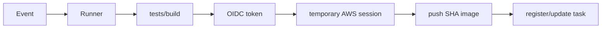

# Lesson 07 — GitHub Actions and Secure Delivery

## Lesson at a glance
- **Stages/time:** workflow model → local/YAML inspection → trust failure reasoning; 80–110 minutes
- **Prerequisite:** [Lesson 06](06-terraform-fundamentals.md)
- **Outcomes:** trace events/jobs/runners, minimize permissions, distinguish cache/artifact/image, explain OIDC/environment protection, and separate app delivery from infrastructure operations.

> **Cost box:** Local inspection creates no AWS resources. GitHub Actions minutes/storage depend on the repository plan. Lesson 11 pushes ECR images and updates a paid Fargate task; infrastructure remains manually destroyed.

## Position and mental model
This is the automation model. CI verifies every change; delivery in Lesson 11 follows the manual 09 and Terraform 10 understanding.



Workflow `permissions` control GitHub token capabilities; IAM controls AWS session capabilities. An artifact is retained workflow output, a cache accelerates repeat work and is not authoritative, and an ECR image is the deployable immutable artifact.

## Guided inspection
Read `.github/workflows/ci.yml` and `deploy-ecs.yml`.

```bash
npm ci
npm run check
git rev-parse HEAD
```

Verify: CI has `contents: read`; deploy adds only `id-token: write`; tests/build precede AWS credentials/deploy; image tag is `${{ github.sha }}`; protected environment `ecs-dev` matches the IAM `sub`; concurrency prevents overlapping deployments; no access-key secret appears. Third-party actions are pinned to full commits resolved from official repositories on 2026-08-16; version comments remain readable, and maintainers must periodically review pins for security updates.

The deploy workflow downloads the active task definition, replaces only the `ecs-api` image, registers a revision, updates the service, waits for stability, then checks ECS task health. Terraform apply/destroy remains a local deliberate operation.

### Checkpoint
- [ ] I can trace trigger → runner → OIDC → STS → ECR → ECS.
- [ ] I can explain every workflow permission and variable.
- [ ] Build/test failure prevents credential acquisition and deployment.
- [ ] A full SHA links source, image, and task revision.

## Bounded failure lab — environment mismatch
Time box: 10 minutes; do not push. In a temporary copy of `deploy-ecs.yml`, change `environment: ecs-dev` to `ecs-test`. Predict STS trust denial because `sub` no longer matches, identify the expected claim in `iam.tf`, then delete the copy. Do not broaden trust to `repo:OWNER/REPO:*`.

## Teardown and audit
Cloud resources created: none. Delete scratch workflow files. Check GitHub repository secrets do not include `AWS_ACCESS_KEY_ID` or `AWS_SECRET_ACCESS_KEY`. In Lesson 11, disable the environment before destroying AWS to prevent redeploy.

## Retrieval quiz
1. GitHub token permissions versus IAM permissions?
2. Cache versus artifact versus image?
3. Why test before OIDC?
4. Why full SHA rather than `latest`?
5. What distinguishes OIDC trust denial from ECR permission denial?
6. Does delivery own Terraform apply/destroy?

<details><summary>Answer key</summary>

1. GitHub API capability versus AWS session capability. 2. Optimization, retained workflow output, deployable container. 3. Failed code never needs cloud credentials. 4. Immutable traceability/rollback. 5. STS fails before credentials versus ECR API AccessDenied after assumption. 6. No; this course keeps infrastructure lifecycle deliberate.
</details>

## Authoritative references
- [Workflow syntax](https://docs.github.com/en/actions/reference/workflows-and-actions/workflow-syntax), [permissions](https://docs.github.com/en/actions/security-for-github-actions/security-guides/automatic-token-authentication), and [AWS OIDC](https://docs.github.com/en/actions/how-tos/secure-your-work/security-harden-deployments/oidc-in-aws) — behavior/security; accessed 2026-08-16.
- [ECS deployment action](https://github.com/aws-actions/amazon-ecs-deploy-task-definition) — task revision flow; accessed 2026-08-16.

## Next lesson
Continue to [Lesson 08](../phase-01-ecs-fargate/08-build-and-test-the-ecs-api.md) with an empty AWS baseline.
