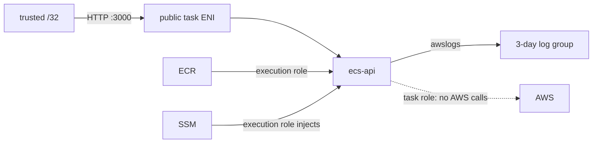

# Lesson 09 — Manual ECS Fargate Deployment

## Lesson at a glance
- **Stages/time:** manual Console deployment → CLI inspection → bounded failure → teardown; 2–3 hours
- **Prerequisite:** [Lesson 08](08-build-and-test-the-ecs-api.md), verified profile/Region, current `/32`
- **Outcomes:** deploy ECR → ECS Fargate, trace network/IAM/config/log flows, smoke health/auth, diagnose a stopped task, and fully delete manual resources.

> **Cost box:** Billing can begin for the running 0.25-vCPU/0.5-GB Fargate task and its public IPv4. ECR storage/scanning, CloudWatch log ingestion/storage, transfer, and optional SSM features may be metered. Standard Parameter Store currently has no parameter storage charge; advanced parameters/higher throughput can cost. No NAT, ALB, Route 53, endpoint, custom metric, or Container Insights. Set a 90-minute teardown alarm.

## Mental model and safety gate


Confirm `aws sts get-caller-identity`, Region, prefix, current prices, teardown time, and empty baseline. Plain HTTP is temporary and restricted to your `/32`; never send a real bearer token over it.

## Part 1 — build and upload immutable image
In ECR Console create `<prefix>-ecs-api`: immutable tags, scan on push, lifecycle keep 5, standard tags. Then:

```bash
export AWS_PROFILE="aws-dev-learning" AWS_REGION="us-east-1"
export ACCOUNT_ID="$(aws sts get-caller-identity --query Account --output text)"
export REPO="<prefix>-ecs-api"
export IMAGE_TAG="$(git rev-parse HEAD)"
aws ecr get-login-password --profile "$AWS_PROFILE" --region "$AWS_REGION" |
  docker login --username AWS --password-stdin "$ACCOUNT_ID.dkr.ecr.$AWS_REGION.amazonaws.com"
docker build -f apps/ecs-api/Dockerfile \
  -t "$ACCOUNT_ID.dkr.ecr.$AWS_REGION.amazonaws.com/$REPO:$IMAGE_TAG" .
if aws ecr describe-images --repository-name "$REPO" \
  --image-ids "imageTag=$IMAGE_TAG" >/dev/null 2>&1; then
  echo "Reusing existing immutable SHA tag."
else
  docker push "$ACCOUNT_ID.dkr.ecr.$AWS_REGION.amazonaws.com/$REPO:$IMAGE_TAG"
fi
```

Do not record the full account ID. Verify ECR shows the 40-character immutable tag and scan status.

## Part 2 — create minimum infrastructure in Console
Apply standard tags with `managed-by=manual`, `course-lesson=09`.
1. **VPC:** `10.42.0.0/16`, DNS support/hostnames; one subnet `10.42.1.0/24`; attach IGW; associate route table with `0.0.0.0/0 → IGW`. Do not add NAT/endpoints.
2. **Security group:** inbound TCP 3000 from your public IPv4 `/32`; outbound TCP 443 to `0.0.0.0/0`. Never use `0.0.0.0/0` inbound.
3. **Logs:** `/aws/ecs/<prefix>-ecs-api`, retention 3 days.
4. **Parameters:** Standard tier. Seed `.../jwt-public-key-base64` as SecureString and issuer/audience as String using `scripts/seed-ecs-parameters.sh`; the script does not print values.
5. **Execution role:** trust `ecs-tasks.amazonaws.com`; attach `AmazonECSTaskExecutionRolePolicy`; inline only `ssm:GetParameters` for the three exact parameter ARNs. **Task role:** same trust, no permissions.
6. **Cluster:** Fargate cluster, Container Insights off.
7. **Task definition:** Fargate, `awsvpc`, Linux x86_64, 0.25 vCPU/0.5 GB; roles above; container `ecs-api`, exact SHA image, essential, port 3000; set `PORT=3000`, `SERVICE_NAME=ecs-api`, `SERVICE_VERSION=<exact SHA>`, `APP_ENVIRONMENT=dev`, and `CORS_ALLOWED_ORIGINS=https://learner.example`; map three JWT `secrets` to parameter ARNs; configure `awslogs` and the health command from `infra/fargate/ecs.tf`.
8. **Service:** one task, public subnet, public IP on, restricted SG, no load balancer, deployment circuit breaker on.

## Part 3 — inspect and smoke
```bash
aws ecs describe-services --profile "$AWS_PROFILE" --region "$AWS_REGION" \
  --cluster "<prefix>-cluster" --services "<prefix>-ecs-api" \
  --query 'services[0].{desired:desiredCount,running:runningCount,events:events[0:3].message}'
export ECS_CLUSTER="<prefix>-cluster" ECS_SERVICE="<prefix>-ecs-api"
PUBLIC_IP="$(./scripts/ecs-public-ip.sh)"
./scripts/smoke-ecs-service.sh "$PUBLIC_IP" "https://learner.example"
aws logs tail "/aws/ecs/<prefix>-ecs-api" --profile "$AWS_PROFILE" \
  --region "$AWS_REGION" --since 10m
```

Expected: desired/running 1, health `HEALTHY`, liveness 200, unauthenticated `/hello` 401, structured startup/request logs. Inspect ECS built-in CPU/memory metrics; do not create custom metrics.

### Checkpoint
- [ ] SHA image, execution/task role boundary, parameter ARNs, ENI route/SG, and log stream are verified.
- [ ] Smoke checks behavior; no secret/token is printed.
- [ ] I can explain all continuing cost sources.
- **Evidence:** exact image SHA, task revision, redacted role/parameter ARNs, smoke summary, and log event metadata.

## Bounded failure lab — wrong parameter ARN
Time box: 15 minutes. Register one new task revision changing only audience `valueFrom` to a nonexistent same-prefix name; update service. Predict `ResourceInitializationError`/parameter retrieval failure and no app logs. Inspect service events and stopped-task reason without reading values. Roll back to the healthy revision and wait stable. Delete the bad revision only after recording the redacted cause.

## Teardown and audit
Delete in dependency order: service (desired zero, wait stopped), cluster, ECR images/repository, log group, externally seeded parameters, role policies/roles, SG, route association/table, IGW, subnet, VPC. Then run `scripts/cleanup-ecs-task-definitions.sh "<prefix>-ecs-api"` to remove every exact-family revision and `scripts/delete-ecs-parameters.sh`; confirm identity and exact prompts. Verify no active/inactive task revision, task/ENI/public IP, image, log group, parameter, or role remains and no NAT/ALB was created. Complete the [global audit](../TEARDOWN_CHECKLIST.md).

## Retrieval quiz
1. Execution role versus task role?
2. Why does this design need a public IP for egress?
3. What does stopped-before-app-logs suggest?
4. Why use a SHA tag?
5. What can cost after stopping the task?
6. Why destroy before Lesson 10?

<details><summary>Answer key</summary>

1. Agent pulls/configures/logs versus app AWS calls. 2. No NAT/endpoints; IGW translation requires public addressing. 3. ECS initialization such as image/config/IAM/network failure. 4. Immutable source traceability. 5. ECR, logs, parameters/transfer tiers; verify current pricing. 6. Terraform should recreate a known empty baseline without ownership collision.
</details>

## Authoritative references
- [Run Fargate tasks](https://docs.aws.amazon.com/AmazonECS/latest/developerguide/AWS_Fargate.html), [task definitions](https://docs.aws.amazon.com/AmazonECS/latest/developerguide/task_definitions.html), [SSM secrets injection](https://docs.aws.amazon.com/AmazonECS/latest/developerguide/secrets-envvar-ssm-paramstore.html) — behavior; accessed 2026-08-16.
- [Fargate pricing](https://aws.amazon.com/fargate/pricing/), [VPC pricing](https://aws.amazon.com/vpc/pricing/), [CloudWatch pricing](https://aws.amazon.com/cloudwatch/pricing/), [ECR pricing](https://aws.amazon.com/ecr/pricing/) — current costs; accessed 2026-08-16.

## Next lesson
After the audit is clean, continue to [Lesson 10](10-reproduce-ecs-fargate-with-terraform.md).
