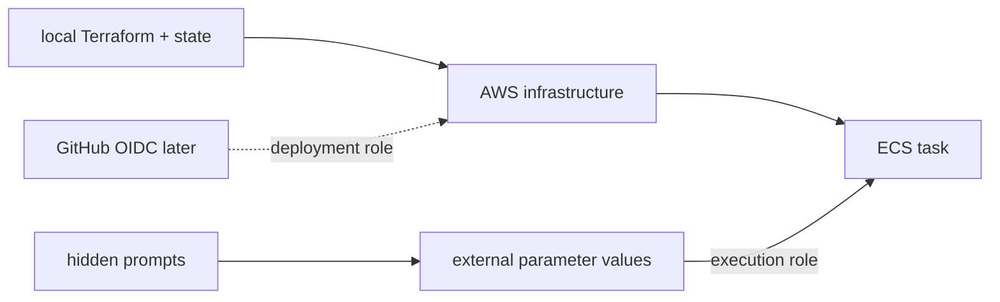

# Lesson 10 — Reproduce ECS Fargate with Terraform

## Lesson at a glance
- **Stages/time:** Terraform plan → bootstrap/apply → inspect → drift failure → destroy/audit; 2–3 hours
- **Prerequisite:** [Lesson 09](09-manual-ecs-fargate-deployment.md) fully torn down
- **Outcomes:** explain/apply `infra/fargate`, keep secret values out of state, verify parity, diagnose drift, and destroy through ownership.

> **Cost box:** `desired_count=1` starts paid Fargate and a paid public IPv4. ECR, scans, logs, transfer, and optional SSM features can also cost. Standard Parameter Store currently has no parameter storage charge; advanced/higher-throughput options can cost. Initial `desired_count=0` creates storage/control-plane resources but no task/public task IP. Destroy today; no NAT/ALB/Route53/endpoints/custom metrics/Insights exist.

## Architecture and boundaries
Terraform owns VPC/subnet/IGW/routes/SG, ECR, cluster, logs, roles/policies, task definition, service, and deployment role. Parameter **values** are externally seeded; the state has names/ARNs only. The deployment role trusts only `repo:OWNER/REPO:environment:ecs-dev`.



## Part 1 — validate and plan zero compute
```bash
export AWS_PROFILE="aws-dev-learning" AWS_REGION="us-east-1"
aws sts get-caller-identity --profile "$AWS_PROFILE"
cp infra/fargate/terraform.tfvars.example infra/fargate/terraform.tfvars
# Replace every placeholder; use current IP/32 and exact HTTPS CORS origin.
# Keep desired_count=0: the example SHA is never allowed to run.
terraform -chdir=infra/fargate init
terraform -chdir=infra/fargate fmt -check
terraform -chdir=infra/fargate validate
terraform -chdir=infra/fargate plan -out=tfplan
terraform -chdir=infra/fargate apply tfplan
```

Explain every planned type and check tags, restricted ingress, 3-day logs, immutable ECR, exact SSM ARNs, empty task-role permissions, environment-scoped OIDC trust, and output warning. State/tfvars/plan stay uncommitted.

## Part 2 — bootstrap artifact/config, then one task
Follow `infra/fargate/README.md`: reuse or push `git rev-parse HEAD`; seed parameters with hidden prompts; set that real SHA and `desired_count=1`; plan/apply. The second plan must replace the task-definition revision and update the service before the first task starts—there is no placeholder-running path. Never pass parameter values as Terraform variables.

```bash
export ECS_CLUSTER="$(terraform -chdir=infra/fargate output -raw ecs_cluster_name)"
export ECS_SERVICE="$(terraform -chdir=infra/fargate output -raw ecs_service_name)"
aws ecs wait services-stable --profile "$AWS_PROFILE" --region "$AWS_REGION" \
  --cluster "$ECS_CLUSTER" --services "$ECS_SERVICE"
PUBLIC_IP="$(./scripts/ecs-public-ip.sh)"
./scripts/smoke-ecs-service.sh "$PUBLIC_IP" "https://learner.example"
terraform -chdir=infra/fargate state list
```

Inspect state keys/ARNs, but do not dump state into notes. Confirm ECS logs, built-in CPU/memory, image SHA, roles, and healthy task.

### Checkpoint
- [ ] Plan was understood before apply and manual parity is proven.
- [ ] State/source/output contain no parameter values.
- [ ] `/health/live` is 200 and `/hello` without auth is 401.
- [ ] I can identify each dependency and cost-bearing resource.
- **Evidence:** reviewed plans, real SHA, healthy revision, five smoke outcomes, and redacted startup metadata.

## Bounded failure lab — safe SG drift
Time box: 15 minutes. In Console, change the SG description only (not rules). Run `terraform plan`; predict an in-place correction and identify drift. Do not apply until the plan contains only that correction. Apply, then verify a clean plan. Never use drift practice on routes, IAM trust, state, or shared resources.

After Lesson 11 begins creating task revisions, GitHub owns later application revisions. Terraform intentionally does not ignore `task_definition`: a later plan exposes the active-revision drift, and applying it deliberately reasserts the SHA in `terraform.tfvars`. This visibility is a safety feature; never apply without deciding which owner should win.

## Teardown and independent audit
Disable any deployment environment first. Run `terraform plan -destroy`, review every object, then `terraform destroy`. Run `scripts/cleanup-ecs-task-definitions.sh "<prefix>-ecs-api"` for Terraform/workflow family revisions, then delete external values with `scripts/delete-ecs-parameters.sh`; neither is owned as a value/revision set in state. Run `scripts/audit-fargate-destroy.sh "<prefix>"`, then independently inspect tasks/ENIs/public IPv4, ECR, logs, SSM, IAM, billing, and accidental Regions. A successful destroy alone is insufficient.

## Retrieval quiz
1. What does Terraform own here?
2. Why apply initially at desired zero?
3. Why are parameter values absent from state?
4. What does a drift plan prove?
5. Which teardown is external?
6. What interface does Lesson 11 consume?

<details><summary>Answer key</summary>

1. Named infrastructure list above, not SSM values/account OIDC provider. 2. Create repository/roles without a failing paid task before image/config exist. 3. Only names/ARNs enter Terraform; script calls SSM directly. 4. Difference among config/state/refreshed reality and proposed repair. 5. Parameter deletion plus independent audit. 6. ECR repo, ECS cluster/service/task-family, OIDC deployment role and protected environment.
</details>

## Authoritative references
- [Terraform AWS ECS service](https://registry.terraform.io/providers/hashicorp/aws/latest/docs/resources/ecs_service), [task definition](https://registry.terraform.io/providers/hashicorp/aws/latest/docs/resources/ecs_task_definition), and [state security](https://developer.hashicorp.com/terraform/language/state/sensitive-data) — behavior; accessed 2026-08-16.
- [ECS task execution IAM role](https://docs.aws.amazon.com/AmazonECS/latest/developerguide/task_execution_IAM_role.html) and [GitHub OIDC](https://docs.github.com/en/actions/how-tos/secure-your-work/security-harden-deployments/oidc-in-aws) — identities; accessed 2026-08-16.

## Next lesson
Continue to [Lesson 11](11-ecs-delivery-and-deploy-to-destroy-capstone.md) only if intentionally keeping this one-task environment briefly; otherwise destroy and rebuild at Lesson 11 start.
