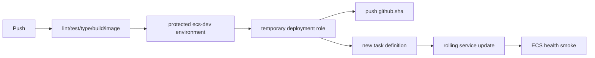

# Lesson 11 — ECS Delivery and Deploy-to-Destroy Capstone

## Lesson at a glance
- **Stages/time:** CI → OIDC delivery → observe/update/recover → destroy/audit/retrieval; 2–3 hours
- **Prerequisite:** [Lesson 10](10-reproduce-ecs-fargate-with-terraform.md), protected GitHub environment
- **Outcomes:** deploy a commit-SHA image without access keys, verify role/image/task revision, recover a failed delivery, and prove a clean account.

> **Cost box:** Keep the one-task environment only for this time-boxed capstone. Fargate/public IPv4 run until zero/destroy; ECR, logs, transfer, optional SSM features, and GitHub usage may continue. Standard Parameter Store currently has no parameter storage charge; advanced/higher-throughput options can cost. Infrastructure is not destroyed by the workflow—teardown is deliberate.

## Delivery model


GitHub has `contents:read` and `id-token:write`; AWS role pushes only to the exact ECR repo, updates the exact ECS service, reads exact task resources where supported, and passes only task/execution roles. Registration's required wildcard is constrained to Region plus the Fargate, non-privileged 256/512 task shape; it requires no tags the workflow omits. No long-lived credential exists. Actions are pinned to full official commit SHAs resolved 2026-08-16. One-at-a-time deployment avoids duplicate Fargate capacity, accepting brief downtime.

## Part 1 — configure and prove CI
Create protected environment `ecs-dev` and make **Deployment branches and tags → Selected branches and tags → `main`** mandatory; never allow all branches. From Terraform outputs, set variables: `AWS_REGION`, `AWS_DEPLOY_ROLE_ARN`, `ECR_REPOSITORY`, `ECS_CLUSTER`, `ECS_SERVICE`, `ECS_TASK_DEFINITION_FAMILY`, `ECS_CONTAINER_NAME=ecs-api`. Require approval if supported. Do not add AWS key secrets.

```bash
npm run check
git status --short
git rev-parse HEAD
```

Push through your normal reviewed branch flow. CI must finish before deploy. Inspect the job permissions and AWS role session name, but never copy OIDC tokens or credentials.

## Part 2 — deploy and verify traceability
Run `Deploy ECS API` manually or merge a matching app change to `main`. The workflow tests/builds, assumes via OIDC, reuses an existing same-SHA tag or pushes it once, renders a task-definition revision, updates/waits, and checks `HEALTHY`. It never attempts to overwrite an immutable tag.

```bash
aws ecs describe-services --profile "$AWS_PROFILE" --region "$AWS_REGION" \
  --cluster "$ECS_CLUSTER" --services "$ECS_SERVICE" \
  --query 'services[0].{running:runningCount,taskDefinition:taskDefinition}'
aws ecs describe-task-definition --profile "$AWS_PROFILE" --region "$AWS_REGION" \
  --task-definition "$ECS_TASK_DEFINITION_FAMILY" \
  --query 'taskDefinition.containerDefinitions[?name==`ecs-api`].image'
PUBLIC_IP="$(./scripts/ecs-public-ip.sh)"
./scripts/smoke-ecs-service.sh "$PUBLIC_IP" "https://learner.example"
```

Image suffix must equal the workflow commit SHA; one task is healthy; learner smoke proves live, ready, unauthenticated 401, allowed CORS, and disallowed CORS. GitHub cannot make this HTTP call because the SG admits only the learner `/32`; the workflow checks ECS task health instead. Inspect complete redacted startup metadata and built-in CPU/memory. Do not send a real JWT over HTTP.

### Capstone checkpoint
- [ ] CI passed before OIDC and deployment.
- [ ] CloudTrail/workflow evidence identifies the temporary role session.
- [ ] Source SHA = ECR tag = active task image.
- [ ] Execution/task/deployment permissions are distinct.
- [ ] Health/auth/config/log/network behavior is verified.
- **Evidence:** workflow URL, source/image SHA, masked revision/task ARN, five smoke outcomes, and redacted startup metadata.

## Bounded failure lab — nonexistent image revision
Time box: 15 minutes and watch cost. Locally register a copy of the current task definition with image tag `0000000000000000000000000000000000000000`, update the service, and predict image-pull failure/circuit-breaker rollback. Prefer doing this only if your role/admin permits the documented CLI; never change workflow trust. Inspect service events/stopped reason, confirm rollback to prior healthy revision, then deregister the failed revision. If rollback is not complete at 15 minutes, update explicitly to the last healthy task definition.

## Update exercise
Make a harmless source change (for example a log message), run checks, commit through normal review, and deploy. Prove a new SHA/revision became healthy and the old image was not overwritten. Revert if you do not want the change retained.

## Parameter rotation + forced deployment exercise
Running tasks do not automatically reread SSM values. Time box: 15 minutes. Run `scripts/seed-ecs-parameters.sh` and enter a newly generated public key plus the intended issuer/audience; record only returned parameter version numbers. Rerun the same commit with `workflow_dispatch`: it must reuse the SHA image, register a revision, and force deployment. Verify a new task ARN/start time, unchanged image SHA, healthy status, all five learner smoke outcomes, and redacted startup metadata. Never call `get-parameter` or print values. On failure, restore prior values through hidden prompts and force another deployment.

## Mandatory teardown and audit
1. Disable/restrict `ecs-dev` so no job can redeploy.
2. From the exact `infra/fargate` state: review `terraform plan -destroy`, then `terraform destroy`.
3. Run `scripts/cleanup-ecs-task-definitions.sh "<prefix>-ecs-api"` to remove all exact-family Terraform/workflow revisions.
4. Delete external SSM values with `scripts/delete-ecs-parameters.sh`.
5. Run `scripts/audit-fargate-destroy.sh "<prefix>"`; it fails if active/inactive family revisions remain.
6. Inspect delete-in-progress definitions, tasks/services, ENIs/public IPv4, ECR, logs, parameters, IAM/trust, VPC, GitHub variables/caches, billing, and accidental Regions. Complete the [global audit](../TEARDOWN_CHECKLIST.md).

The capstone is incomplete until desired/running tasks are zero, public task IP/ENI is gone, retained image/log/parameter exceptions are empty, and a billing recheck is scheduled.

## Retrieval quiz
1. Why does the workflow need `id-token:write`?
2. What proves artifact immutability/traceability?
3. Why can the deployment role pass roles but not use task permissions?
4. What signal separates image-pull failure from app health failure?
5. What can cost after workflow success or stopped compute?
6. Why disable delivery before destroy?

<details><summary>Answer key</summary>

1. Request GitHub's OIDC token for STS exchange. 2. Full source SHA appears as ECR tag and active task image. 3. `iam:PassRole` delegates exact roles to ECS; it does not grant their permissions to the deployer. 4. ECS stopped reason before app logs versus unhealthy container/app logs. 5. Running replacement task/public IPv4, ECR, logs, transfer, parameters, Actions. 6. Prevent a concurrent/retried job recreating workload during teardown.
</details>

## Authoritative references
- [GitHub AWS OIDC](https://docs.github.com/en/actions/how-tos/secure-your-work/security-harden-deployments/oidc-in-aws), [workflow permissions](https://docs.github.com/en/actions/security-for-github-actions/security-guides/automatic-token-authentication) — secure session; accessed 2026-08-16.
- [ECS deployment circuit breaker](https://docs.aws.amazon.com/AmazonECS/latest/developerguide/deployment-circuit-breaker.html), [service deployment parameters](https://docs.aws.amazon.com/AmazonECS/latest/developerguide/deployment-type-ecs.html) — recovery/capacity; accessed 2026-08-16.
- [ECS IAM actions/resources](https://docs.aws.amazon.com/service-authorization/latest/reference/list_ecs.html) and [ECR push permissions](https://docs.aws.amazon.com/AmazonECR/latest/userguide/image-push-iam.html) — least-privilege boundaries; accessed 2026-08-16.
- [AWS Fargate pricing](https://aws.amazon.com/fargate/pricing/) and [VPC pricing](https://aws.amazon.com/vpc/pricing/) — current cost; accessed 2026-08-16.

## Next navigation
Return to the [syllabus](../README.md) for Phase 02. Carry forward only quiz/evidence notes; the default AWS baseline is fully torn down.
