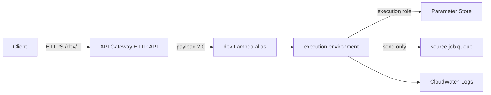

# Lesson 12 — Lambda Execution Model

## Lesson at a glance
- **Stages/time:** model → worked event inspection → retrieval; 75–90 minutes
- **Prerequisite:** [Lesson 11](../phase-01-ecs-fargate/11-ecs-delivery-and-deploy-to-destroy-capstone.md), fully torn down
- **Requirements:** repository source, paper or diagram tool; no AWS credentials required
- **Outcomes:** trace an HTTP API payload-v2 request, distinguish initialization/cold/warm invocation, and identify Lambda health, identity, observability, cost, and teardown boundaries.

> **Cost box:** Conceptual and local inspection only. Cloud resources created: none. Lambda and HTTP API have no idle minimum, but later invocations/duration, API requests, logs, SQS, transfer, and optional features can be metered. “Serverless” does not mean free.

## Track position and safety gate
This lesson is the model stage. Lesson 13 builds locally; 14 performs manual → CLI → Terraform; 15 promotes between explicit stages; 16 deploys code through GitHub OIDC and destroys everything.



No Route 53, custom domain, VPC attachment, provisioned concurrency, custom metric, or X-Ray is part of this track. Before any later cloud lab, name the account/Region, expiration time, chargeable resources, and deletion proof.

## The execution model
Lambda stores function configuration and code. When an invocation needs capacity, the service creates an execution environment, starts the runtime, evaluates module-scope code, then calls the exported handler. That first use of a newly initialized environment is a **cold start**. AWS may reuse that environment for later **warm invocations**, freeze it between requests, create several environments concurrently, or remove it without notice.

Module-scope clients and a bounded configuration cache can be reused, but are not durable or globally unique:

- a warm cache avoids an SSM read on every request;
- a TTL bounds how long rotation can remain unseen in one environment;
- concurrent environments each have an independent cache;
- eviction can happen before TTL, because the environment can disappear; and
- process memory must never be the system of record.

Reserved concurrency limits simultaneous environments; it does not keep an environment warm. Provisioned concurrency can pre-initialize capacity and costs while configured, so this course deliberately omits it.

### Predict before proceeding
1. After a parameter rotates, can two simultaneous environments briefly validate against different cached values?
2. If module initialization throws because an ordinary env var is invalid, will a handler request-completion log exist?

Answers: yes, until each bounded cache refreshes; and no—the invocation fails during initialization before the handler runs, while Lambda/platform logs still provide evidence.

## HTTP API payload format 2.0
API Gateway terminates HTTPS at its built-in `execute-api` endpoint and converts the request into `APIGatewayProxyEventV2`. Important fields are:

```json
{
  "version": "2.0",
  "routeKey": "GET /api/hello",
  "rawPath": "/api/hello",
  "headers": { "authorization": "Bearer <redacted>" },
  "requestContext": {
    "requestId": "example",
    "stage": "dev",
    "http": { "method": "GET", "path": "/dev/api/hello" }
  }
}
```

Do not copy payload format 1.0 assumptions into this handler. The application routes on method plus `rawPath`, uses `requestContext.stage` to choose the `dev` or `stage` parameter path, and correlates logs with `requestContext.requestId`. API Gateway CORS owns browser response headers; bearer tokens and bodies never belong in logs or evidence.

The returned object is a proxy response: status, JSON content type, and serialized body. A thrown error is not an HTTP response; the handler maps expected boundaries and returns a safe 500 without the exception message.

## Health semantics
Lambda has no continuously running process for a load balancer to probe:

- `GET /health/live` proves API reachability and handler execution. It is **not** a container restart probe.
- `GET /health/ready` additionally proves that required runtime auth configuration can be retrieved/validated for the request stage. It is **not** a scheduler traffic gate.
- Lambda platform `State`, `LastUpdateStatus`, invocation errors, and initialization logs diagnose deployment/runtime health.

A 200 response does not prove every downstream operation. `/jobs` separately proves SQS send permission, and protected `/api/hello` proves auth configuration.

## Identity, logs, and built-in metrics
API Gateway receives the public request and has a resource-based permission to invoke only the matching Lambda alias. Lambda assumes the execution role. That role—not the caller and not GitHub—reads six exact SSM parameter ARNs, writes the pre-created function log group, and sends only to one queue.

Safe application logs include initialization, cold-start state, request ID, API stage, method/path, status, duration, job ID, and error type. They exclude token, parameter value, full body, and exception message. API access logs record request/stage/route/status/latency without headers.

Use free built-in service metrics before paid custom telemetry:

- Lambda: `Invocations`, `Errors`, `Duration`, `Throttles`, `ConcurrentExecutions`;
- HTTP API: `Count`, `Latency`, `IntegrationLatency`, `4xx`, and `5xx`.

CloudWatch log ingestion/storage and detailed/custom metrics can be priced. This track pre-creates three-day log groups and does not enable paid custom metrics.

## Worked inspection
Open `apps/lambda-api/src/index.ts`, `handler.ts`, `parameters.ts`, and `infra/lambda/api.tf`. Trace:

1. module initialization validates ordinary env configuration and creates AWS SDK clients;
2. API stage chooses a bounded per-stage SSM cache entry;
3. `/health/live` avoids dependencies; `/health/ready` loads runtime config;
4. protected routes validate a bearer token without logging it;
5. `/jobs` validates the shared contract and sends one message; and
6. response/access logs correlate on request ID and stage.

### Checkpoint
- [ ] I can draw cold initialization and two warm invocations.
- [ ] I can explain payload 2.0 fields used by this app.
- [ ] I can distinguish reachability, readiness, auth, and queue-send evidence.
- [ ] I can name every runtime permission and excluded feature.
- **Evidence:** hand-drawn flow plus answers to the predictions; no cloud identifiers or secrets.

## Intentional reasoning failure
Claim: “A warm invocation always sees the latest Parameter Store value.” Refute it from the cache TTL, per-environment isolation, and environment lifecycle. Recovery is conceptual: state the bounded-staleness contract and the operational option to wait one TTL or deliberately publish/promote a new environment. Never promise immediate global rotation without designing for it.

## Teardown and audit
Cloud resources created: none. Confirm the prior Fargate audit remains clean. Do not run Terraform or create a Lambda merely to complete this lesson.

## Retrieval quiz
1. Which work occurs during initialization versus invocation?
2. What can and cannot be inferred from a warm request?
3. Which payload-v2 fields provide route, stage, and correlation?
4. Why are Lambda live/ready endpoints not container probes?
5. Which identity reads SSM and sends SQS?
6. Where does this lesson sit in the track loop?

<details><summary>Answer key</summary>

1. Module evaluation/client/config setup versus per-event routing. 2. Reuse may occur, but neither reuse nor cache freshness/durability is guaranteed. 3. `routeKey`/`rawPath`, `requestContext.stage`, and `requestContext.requestId`. 4. No continuously scheduled process is restarted or removed from a target group by these routes. 5. The Lambda execution role. 6. It establishes the model before local, manual/CLI, Terraform, and GHA work.
</details>

## Authoritative references
- [Lambda execution environment](https://docs.aws.amazon.com/lambda/latest/dg/lambda-runtime-environment.html) and [best practices](https://docs.aws.amazon.com/lambda/latest/dg/best-practices.html) — initialization/reuse; accessed 2026-08-16.
- [HTTP API Lambda integrations](https://docs.aws.amazon.com/apigateway/latest/developerguide/http-api-develop-integrations-lambda.html) — payload 2.0; accessed 2026-08-16.
- [Lambda metrics](https://docs.aws.amazon.com/lambda/latest/dg/monitoring-metrics-types.html), [HTTP API metrics](https://docs.aws.amazon.com/apigateway/latest/developerguide/http-api-metrics.html), and [CloudWatch pricing](https://aws.amazon.com/cloudwatch/pricing/) — observability/cost; accessed 2026-08-16.
- [Lambda pricing](https://aws.amazon.com/lambda/pricing/) and [API Gateway pricing](https://aws.amazon.com/api-gateway/pricing/) — current usage pricing; accessed 2026-08-16.

## Next lesson
Continue to [Lesson 13](13-build-the-native-lambda-api.md). Carry only the model/evidence; AWS remains empty.
