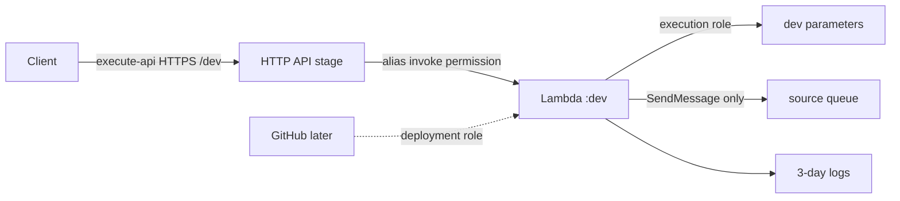

# Lesson 14 — Manual Lambda API, Then Terraform

## Lesson at a glance
- **Stages/time:** package → manual Console deployment → CLI inspection/failure/teardown → Terraform reproduce/destroy; 3–4 hours
- **Prerequisite:** [Lesson 13](13-build-the-native-lambda-api.md), verified profile/Region and teardown deadline
- **Outcomes:** deploy one native Lambda/API manually, trace execution/invoke permissions, reproduce it with `infra/lambda`, and prove full teardown without exposing parameter values.

> **Cost box:** Lambda duration/requests, HTTP API requests, SQS API requests, log ingestion/storage, and applicable transfer may be metered. SQS does not separately charge for retained-message storage. Standard parameters currently have no parameter storage charge; advanced/higher-throughput options can cost. IAM roles, API definitions, aliases, and reserved concurrency do not create an idle compute fee. No VPC/public IPv4, NAT, Route 53, custom domain, provisioned concurrency, custom metric, or X-Ray exists. Set a two-hour alarm and destroy today.

## Safety gate and architecture


Export and verify:

```bash
export AWS_PROFILE="aws-dev-learning" AWS_REGION="us-east-1"
aws sts get-caller-identity --profile "$AWS_PROFILE"
export PREFIX="<unique-lowercase-prefix>"
export PARAMETER_BASE="/aws-developer-course/lambda"
./scripts/package-lambda.sh
```

Record masked account, Region, expiration, artifact CodeSha256, current prices, and empty baseline. The manual stack uses suffix `-manual`; Terraform later uses the ordinary prefix. Never place values in commands, notes, Terraform variables, or outputs.

## Part 1 — seed parameters and create manual runtime
Seed Standard parameters with hidden prompts:

```bash
LAMBDA_PARAMETER_BASE_PATH="$PARAMETER_BASE" \
  ./scripts/seed-lambda-parameters.sh dev
```

In the Console, apply course tags with `managed-by=manual`, `course-lesson=14`, and the expiration:

1. Create Standard SQS queue `$PREFIX-source-jobs-manual`, one-day retention, long polling, SQS-managed encryption. Do not create a DLQ/redrive policy.
2. Pre-create `/aws/lambda/$PREFIX-lambda-api-manual` with three-day retention.
3. Create a role trusted by `lambda.amazonaws.com`. Inline only `logs:CreateLogStream`/`PutLogEvents` on that log group's streams, `ssm:GetParameters` on the three exact `dev` ARNs, and `sqs:SendMessage` on the exact queue ARN. Do not attach broad Lambda basic/SSM/SQS policies.
4. Create a Node.js 24 x86_64 function from the zip: handler `index.handler`, 256 MB, 10 seconds, reserved concurrency 2, and the role above. Set only `SERVICE_NAME`, queue URL, parameter base path, and TTL `30`.
5. Publish version `1` and create alias `dev → 1`. Publishing is the immutable boundary; `$LATEST` is mutable.

The log group exists before the function so the role needs no `logs:CreateLogGroup`. AWS-managed SSM encryption requires no explicit `kms:Decrypt`; a customer-managed key would require one exact-key grant.

## Part 2 — direct invocation before HTTP
Save a local, non-secret payload-v2 event:

```bash
event_file="$(mktemp)"
cat >"$event_file" <<'JSON'
{"version":"2.0","routeKey":"GET /health/live","rawPath":"/health/live","rawQueryString":"","headers":{},"requestContext":{"accountId":"000000000000","apiId":"direct","domainName":"direct","domainPrefix":"direct","http":{"method":"GET","path":"/health/live","protocol":"HTTP/1.1","sourceIp":"127.0.0.1","userAgent":"aws-cli"},"requestId":"direct-lesson-14","routeKey":"GET /health/live","stage":"dev","time":"16/Aug/2026:00:00:00 +0000","timeEpoch":1786838400000},"isBase64Encoded":false}
JSON
aws lambda invoke \
  --profile "$AWS_PROFILE" --region "$AWS_REGION" \
  --function-name "$PREFIX-lambda-api-manual:dev" \
  --cli-binary-format raw-in-base64-out \
  --payload "fileb://$event_file" /tmp/lambda-response.json \
  --query '{status:StatusCode,functionError:FunctionError,version:ExecutedVersion}'
rm -f "$event_file" /tmp/lambda-response.json
```

Expected: platform status 200, no `FunctionError`, executed version `1`. Platform status is not the handler body's HTTP status; API Gateway interprets the proxy response later.

## Part 3 — create and inspect the HTTP API
Create an API Gateway **HTTP API**, not a REST API. Configure exact HTTPS CORS origins, methods GET/POST/OPTIONS, and authorization/content-type headers. Create a Lambda proxy integration with payload format `2.0`. Use the documented Lambda integration URI with an alias stage variable:

```text
arn:aws:apigateway:REGION:lambda:path/2015-03-31/functions/FUNCTION_ARN:${stageVariables.lambda_alias}/invocations
```

Add routes `GET /health/live`, `GET /health/ready`, `GET /api/hello`, and `POST /jobs`. Create an explicit non-auto-deploy `dev` stage with `lambda_alias=dev`, a deployment snapshot, and JSON access logs to a pre-created three-day `/aws/apigateway/$PREFIX-lambda-api-manual/dev` log group. Add Lambda resource permission on qualifier `dev`, principal `apigateway.amazonaws.com`, and source ARN restricted to this API's `dev/*/*`.

Do not create `$default`, a custom domain, or Route 53 record. The endpoint is:

```text
https://API_ID.execute-api.REGION.amazonaws.com/dev
```

Inspect independently:

```bash
aws apigatewayv2 get-apis --profile "$AWS_PROFILE" --region "$AWS_REGION" \
  --query "Items[?Name==\`$PREFIX-lambda-api-manual\`].{id:ApiId,endpoint:ApiEndpoint,protocol:ProtocolType}"
aws lambda get-policy --profile "$AWS_PROFILE" --region "$AWS_REGION" \
  --function-name "$PREFIX-lambda-api-manual" --qualifier dev
aws lambda get-function-configuration --profile "$AWS_PROFILE" --region "$AWS_REGION" \
  --function-name "$PREFIX-lambda-api-manual" --qualifier dev \
  --query '{state:State,lastUpdate:LastUpdateStatus,version:Version,role:Role}'
```

Run `scripts/smoke-lambda-api.sh` against the `/dev` URL. Optionally use `--authenticated`; the token is read silently and never sent in a shell argument or workflow. Do not submit `/jobs` unless you explicitly intend to create a queue message.

Inspect structured app/access logs and free built-in metrics. A first request should have `coldStart:true`; a later request in the same environment can have `false`, but reuse is not guaranteed.

### Manual checkpoint
- [ ] Direct and execute-api invocations are distinguished.
- [ ] Payload format 2.0, dev stage variable, alias, and invoke permission align.
- [ ] Ready/auth load dev parameters; `/jobs` can send only to the source queue.
- [ ] Logs/metrics show request ID, stage, status, duration, and invocation evidence.
- **Evidence:** artifact hash, executed version, API ID masked if desired, smoke summary, role/policy summary, and redacted log metadata.

## Bounded manual failure — invalid runtime parameter
Time box: 12 minutes. Use the Parameter Store Console to replace the `dev` audience with an empty/whitespace-only value without displaying it in notes. Wait one cache TTL, call ready, and predict 503 plus safe `readiness.failed` metadata. Restore the intended value using the hidden seed script, wait one TTL, and verify 200. Do not retrieve/print either value. If sharing an account, use a dedicated prefix and stop if another learner depends on it.

## Manual teardown
Delete in dependency order: API stages/deployments/routes/integration/API, alias/function, access/function log groups, source queue, inline role policy/role, then the three external parameters. Confirm no published function version, invoke policy, message, or log group remains. Run the global audit before Terraform so ownership cannot collide.

## Part 4 — reproduce with Terraform
Read `infra/lambda/README.md`, then:

```bash
./scripts/package-lambda.sh
cp infra/lambda/terraform.tfvars.example infra/lambda/terraform.tfvars
# Use absolute artifact_path, prefix/owner/expiry,
# exact HTTPS CORS origin, repository, and existing OIDC provider.
terraform -chdir=infra/lambda init
terraform -chdir=infra/lambda fmt -check
terraform -chdir=infra/lambda validate
terraform -chdir=infra/lambda plan -out=tfplan
```

Explain the plan before apply:

- artifact hash publishes a version; aliases initially point to it;
- stage variables route `dev`/`stage` to matching aliases;
- Lambda permissions are qualifier- and API-stage-scoped;
- values are absent; only six parameter names/ARNs enter policy/state;
- log groups have three-day retention;
- the role has only logs, exact SSM reads, and source-queue send;
- the deployment role trusts only the repository's `lambda-deploy` environment; and
- the queue is producer-owned here, while future `infra/sqs` owns worker/DLQ/redrive/event mapping.

Terraform bootstraps the first zip and then ignores code-hash/alias-pointer drift because the delivery workflow owns later code versions and promotion. Function runtime configuration remains Terraform-owned. After a configuration apply, delivery must select or publish a version matching both the artifact hash and current configuration before moving an alias.

Learners may now apply the reviewed plan, seed both stages, smoke `/dev` and `/stage`, inspect outputs/state keys without dumping state, and compare parity with manual deployment. Infrastructure uses local state and does not automate apply/destroy.

### Terraform checkpoint
- [ ] Plan and dependency graph are explainable before apply.
- [ ] Both explicit stages use payload 2.0 and built-in HTTPS.
- [ ] State/output/source contain no parameter values.
- [ ] Dev and stage smoke pass after external seeding.
- **Evidence:** reviewed plan summary, API URLs, function version/hash, alias targets, queue ARN masked, and six parameter names—not values.

## Terraform teardown and audit
If proceeding immediately to Lesson 15, keep the time-boxed stack. Otherwise disable delivery, destroy future `infra/sqs` consumers first, then:

```bash
terraform -chdir=infra/lambda plan -destroy
terraform -chdir=infra/lambda destroy
./scripts/delete-lambda-parameters.sh dev
./scripts/delete-lambda-parameters.sh stage
./scripts/audit-lambda-destroy.sh "$PREFIX"
```

Delete local `tfplan`, state/tfvars if no longer needed, and artifacts after evidence. Complete the [global teardown checklist](../TEARDOWN_CHECKLIST.md).

## Retrieval quiz
1. Execution role versus Lambda resource policy?
2. Why pre-create the log group?
3. What is immutable: zip, published version, alias, or stage?
4. Why are parameter data/resources absent from Terraform?
5. Which queue pieces belong to Phase 02 versus Phase 03?
6. Why tear down manual resources before Terraform?

<details><summary>Answer key</summary>

1. Runtime AWS calls versus permission for API Gateway to invoke an alias. 2. Control retention and avoid `CreateLogGroup`. 3. Zip bytes/content hash and published version; aliases/stage pointers are mutable promotion controls. 4. Values are externally seeded to avoid ordinary config/state disclosure. 5. Source queue/send-only producer here; worker/DLQ/redrive/event mapping later. 6. Prevent name/ownership collisions and prove reproduction from empty.
</details>

## Authoritative references
- [Lambda execution role](https://docs.aws.amazon.com/lambda/latest/dg/lambda-intro-execution-role.html), [resource access permissions](https://docs.aws.amazon.com/lambda/latest/dg/access-control-resource-based.html), and [Lambda IAM actions](https://docs.aws.amazon.com/service-authorization/latest/reference/list_awslambda.html) — identity; accessed 2026-08-16.
- [HTTP API stages](https://docs.aws.amazon.com/apigateway/latest/developerguide/http-api-stages.html) and [stage variables](https://docs.aws.amazon.com/apigateway/latest/developerguide/http-api-stages.stage-variables.html) — explicit routing; accessed 2026-08-16.
- [Terraform Lambda function](https://registry.terraform.io/providers/hashicorp/aws/latest/docs/resources/lambda_function), [API v2 stage](https://registry.terraform.io/providers/hashicorp/aws/latest/docs/resources/apigatewayv2_stage), and [Terraform sensitive state](https://developer.hashicorp.com/terraform/language/state/sensitive-data) — IaC behavior; accessed 2026-08-16.
- [SSM pricing](https://aws.amazon.com/systems-manager/pricing/), [Lambda pricing](https://aws.amazon.com/lambda/pricing/), [API Gateway pricing](https://aws.amazon.com/api-gateway/pricing/), [SQS pricing](https://aws.amazon.com/sqs/pricing/) — current costs; accessed 2026-08-16.

## Next lesson
Continue to [Lesson 15](15-api-gateway-stages-and-promotion.md) with the Terraform stack only if the teardown deadline still allows; otherwise rebuild from the reviewed local state.
