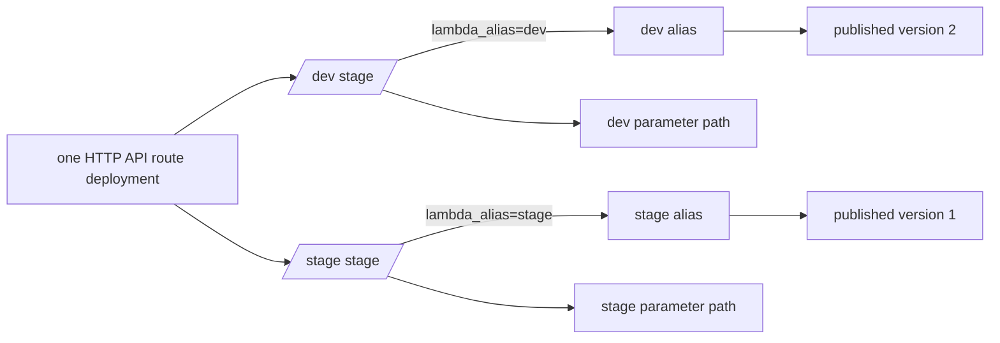

# Lesson 15 — API Gateway Stages and Promotion

## Lesson at a glance
- **Stages/time:** inspect stages → isolate config → publish/promote version → rotate/cache → drift failure/recovery; 2–3 hours
- **Prerequisite:** [Lesson 14](14-manual-lambda-api-then-terraform.md) Terraform stack, both parameter sets seeded
- **Outcomes:** explain route deployment versus Lambda version promotion, prove dev/stage isolation, measure bounded rotation staleness, and recover stage drift.

> **Cost box:** Keep this short-lived stack only through Lesson 16. Lambda/API/SQS-request/log/transfer usage can be metered; log storage and queued messages persist without requests, although SQS has no separate retained-message storage fee. Standard parameters currently have no storage charge, subject to current tier/throughput pricing. Two aliases do not reserve two running servers and do not add provisioned concurrency.

## Promotion model


Three mutable pointers have different ownership:

- an API Gateway stage points to an API deployment snapshot and carries non-secret stage variables;
- a Lambda alias points to one immutable published function version; and
- each request's `requestContext.stage` chooses an independently cached Parameter Store path.

Application promotion moves an alias. Route/integration/CORS changes create a Terraform-managed API deployment. Parameter rotation changes an externally managed value and becomes visible after cache refresh. Do not conflate these operations or put secrets in stage variables.

## Part 1 — inspect explicit stages
```bash
export AWS_PROFILE="aws-dev-learning" AWS_REGION="us-east-1"
export API_ID="$(terraform -chdir=infra/lambda output -raw api_id)"
export FUNCTION_NAME="$(terraform -chdir=infra/lambda output -raw lambda_function_name)"
aws apigatewayv2 get-stages --profile "$AWS_PROFILE" --region "$AWS_REGION" \
  --api-id "$API_ID" \
  --query 'Items[].{stage:StageName,deployment:DeploymentId,auto:AutoDeploy,variables:StageVariables}'
aws lambda list-aliases --profile "$AWS_PROFILE" --region "$AWS_REGION" \
  --function-name "$FUNCTION_NAME" \
  --query 'Aliases[].{name:Name,version:FunctionVersion}'
```

Expected: only `dev` and `stage`; both are explicit and `AutoDeploy=false`; each has its matching non-secret alias variable. The initial aliases may point to the same version, but their URLs and runtime configuration are distinct.

Smoke both URLs. In logs, match access and function records by API request ID. Confirm `stage=dev` and `stage=stage`; never infer environment from hostname alone.

## Part 2 — prove configuration isolation
Seed the two stages with valid keys but different issuer/audience values. Use a token valid only for dev:

```bash
./scripts/smoke-lambda-api.sh "<dev-url>" --authenticated
# Reuse the same token only as a negative test against stage; expect 401.
```

Read the token silently when prompted. Never export it, put it in history, or paste it into evidence. A dev-auth success and stage-auth rejection prove configuration selection better than reading parameter values.

Readiness for each stage retrieves/validates that stage's values, but readiness does not prove that a particular token will pass. Unauthenticated `/api/hello` remains 401 in both stages.

### Checkpoint 1 — stage isolation
- [ ] Dev/stage stage variables and aliases align.
- [ ] Access/function logs correlate request ID and stage.
- [ ] A stage-specific auth behavior proves path isolation without value disclosure.
- [ ] I can distinguish API deployment, alias, and parameter changes.
- **Evidence:** stage/deployment IDs, alias versions, smoke statuses, and redacted log metadata.

## Part 3 — publish once, promote twice
Make one harmless local application change, run checks, and create a deterministic artifact. Do not change infrastructure or runtime parameter names:

```bash
npm run check
./scripts/package-lambda.sh
export CODE_SHA256="$(openssl dgst -sha256 -binary artifacts/lambda-api.zip | openssl base64 -A)"
```

Publish the zip once using a suitably authorized learning identity, wait for update success, and record the returned numeric version. The later OIDC workflow performs this same content-hash/reuse operation with narrower permissions. Never point an alias at `$LATEST`.

Move `dev` to the new numeric version, smoke/log it, then move `stage` to the **same** version only after dev evidence passes:

```bash
aws lambda update-alias --profile "$AWS_PROFILE" --region "$AWS_REGION" \
  --function-name "$FUNCTION_NAME" --name dev --function-version "$NEW_VERSION"
./scripts/smoke-lambda-api.sh "<dev-url>"

aws lambda update-alias --profile "$AWS_PROFILE" --region "$AWS_REGION" \
  --function-name "$FUNCTION_NAME" --name stage --function-version "$NEW_VERSION"
./scripts/smoke-lambda-api.sh "<stage-url>"
```

Before each move, use `get-function-configuration --qualifier "$NEW_VERSION"` to confirm `CodeSha256`, `State=Active`, and `LastUpdateStatus=Successful`. If dev fails, move dev back to its recorded prior version; do not promote stage. Alias updates are rerunnable: if already at the intended version, no change is required.

Terraform intentionally ignores code-hash and alias `function_version` drift because application delivery owns those after bootstrap. It still owns function runtime configuration, aliases, routes, permissions, and stages. After a configuration change, delivery must promote a version matching both current configuration and artifact hash. Deleting/recreating an alias outside Terraform remains drift.

### Checkpoint 2 — promotion evidence
- [ ] One artifact hash maps to one published numeric version.
- [ ] Dev passed before stage moved.
- [ ] Both aliases end at the same intended version/hash.
- [ ] Rollback versions were recorded before mutation.
- **Evidence:** source SHA, CodeSha256, numeric version, before/after alias targets, smoke/log summary.

## Part 4 — Parameter Store rotation and warm caches
Rotate only dev with the hidden script and record returned SSM version numbers, not values:

```bash
./scripts/seed-lambda-parameters.sh dev
```

Immediately repeat a valid old-token request, then repeat after the configured 30-second TTL. Possible immediate results depend on which execution environment API Gateway invokes: old cached behavior or a cold/new cache. The bounded claim is not “exactly 30 seconds globally”; it is that each reused cache entry refreshes at/after its own expiry, while new/retired environments change the observation.

Prove the new behavior without printing values, then rotate stage separately. If urgent invalidation is required in a real design, publishing/promoting a new version forces fresh environments more predictably but still needs an explicit operational strategy; this course does not add provisioned concurrency or a cache-control service.

## Bounded failure lab — wrong stage variable
Time box: 12 minutes. In the API Gateway Console, change only the `stage` stage variable from `stage` to `missing`, deploy that stage if required, and predict:

- `/dev` remains healthy;
- `/stage` integration fails because no matching alias/permission exists;
- API access logs show integration/5xx evidence; and
- function request logs are absent for the failed stage request.

Run `terraform plan` and identify the stage-variable drift. Apply only after confirming the plan restores that single intended field (plus no unreviewed alias demotion). Re-smoke both URLs. Never troubleshoot by broadening Lambda invoke permission to unqualified `*`.

## Teardown decision
Continue directly to Lesson 16 only within the expiration window. Otherwise disable delivery, destroy any Phase 03 consumer first, `terraform destroy`, delete both external parameter sets, run `audit-lambda-destroy.sh`, remove artifacts/state as intended, and complete the global audit.

## Retrieval quiz
1. Stage deployment versus Lambda alias?
2. Why can dev/stage use different auth with the same function version?
3. Why does cache rotation not have one global visibility instant?
4. What evidence says API Gateway failed before Lambda invocation?
5. Why does Terraform ignore only alias pointer drift?
6. What exact sequence makes promotion safe and rerunnable?

<details><summary>Answer key</summary>

1. Routes/integration snapshot versus immutable code-version pointer. 2. Event stage selects separate SSM paths/cache entries. 3. Each execution environment has an independent TTL and lifecycle. 4. API integration 5xx/access error with no correlated function request log. 5. Delivery owns application promotion, while Terraform retains structural ownership. 6. Identify hash/version, record rollback, move dev, verify, then move stage; no-op if already targeted.
</details>

## Authoritative references
- [HTTP API stages](https://docs.aws.amazon.com/apigateway/latest/developerguide/http-api-stages.html) and [HTTP API stage variables](https://docs.aws.amazon.com/apigateway/latest/developerguide/http-api-stages.stage-variables.html) — stage behavior; accessed 2026-08-16.
- [Lambda versions](https://docs.aws.amazon.com/lambda/latest/dg/configuration-versions.html) and [aliases](https://docs.aws.amazon.com/lambda/latest/dg/configuration-aliases.html) — immutable versions/mutable pointers; accessed 2026-08-16.
- [Lambda environment reuse](https://docs.aws.amazon.com/lambda/latest/dg/lambda-runtime-environment.html) — cache observations; accessed 2026-08-16.

## Next lesson
Continue to [Lesson 16](16-lambda-delivery-and-runtime-comparison.md). Preserve the Terraform state, protected-stage evidence, prior alias targets, and teardown deadline.
