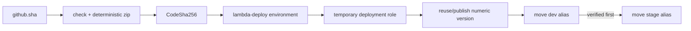

# Lesson 16 — Lambda Delivery and Runtime Comparison

## Lesson at a glance
- **Stages/time:** CI/package → OIDC dev delivery → evidence → stage promotion → failure recovery → compare/destroy; 2–3 hours
- **Prerequisite:** [Lesson 15](15-api-gateway-stages-and-promotion.md), protected GitHub environment and applied Terraform stack
- **Outcomes:** deploy/reuse an immutable zip without access keys, prove exact alias/hash status, compare Lambda/Fargate from evidence, and return to a clean account.

> **Cost box:** This is the mandatory deploy-to-destroy capstone. Lambda/API/SQS-request/log/transfer usage can be metered until teardown; queued messages and log storage can persist after requests stop, although SQS has no separate retained-message storage fee. GitHub Actions usage may be metered by plan. Infrastructure is never destroyed by the workflow. No custom domain, Route 53, VPC, provisioned concurrency, custom metric, or container registry exists in this track.

## Delivery model


The workflow has only `contents:read` and `id-token:write`. The trust policy accepts only `repo:OWNER/REPO:environment:lambda-deploy` with audience `sts.amazonaws.com`. The role can read/update/publish the exact function and read/move aliases only on that function. Lambda authorizes `GetAlias`/`UpdateAlias` against the unqualified function ARN, so IAM cannot narrow those actions to alias ARNs; the validated workflow input supplies the `dev|stage` guard. The role cannot change IAM, environment variables, API routes/stages, parameters, queue, logs, or Terraform state.

Official actions are pinned to full commit SHAs recorded in `.github/workflows/deploy-lambda.yml`; comments name the reviewed major version. Pins prevent a mutable tag from changing silently, but maintainers must still review upstream security updates.

## Part 1 — configure protected delivery
Create GitHub environment `lambda-deploy`. Restrict deployment branches/tags to selected `main` and require approval if available. Add only non-secret variables from Terraform outputs:

- `AWS_REGION`;
- `AWS_DEPLOY_ROLE_ARN`; and
- `LAMBDA_FUNCTION_NAME`.

Do not add access key ID/secret/session token, auth token, parameter values, queue URL, or Terraform state. The workflow's target stage is a constrained `dev|stage` dispatch input; pushes to `main` target dev.

Before pushing:

```bash
npm run check
./scripts/package-lambda.sh
git status --short
git rev-parse HEAD
```

The workflow repeats checks/package before OIDC. It computes the AWS-compatible zip hash and a non-secret fingerprint of the current Terraform-managed runtime configuration. It reuses the newest exact-function version matching both or publishes once. A rerun of identical bytes and configuration is a no-op at the code/version boundary. It then moves only the selected alias if needed and verifies alias version, `State=Active`, `LastUpdateStatus=Successful`, and exact `CodeSha256`.

## Part 2 — deliver dev and verify outside GitHub
Run `Deploy Lambda API` for `dev` from the approved source. Inspect job permissions, protected-environment approval, OIDC role session name, source SHA, artifact hash, numeric version, and final status. Never inspect or copy the OIDC token/temporary credentials.

Independently:

```bash
export AWS_PROFILE="aws-dev-learning" AWS_REGION="us-east-1"
export FUNCTION_NAME="$(terraform -chdir=infra/lambda output -raw lambda_function_name)"
aws lambda get-alias --profile "$AWS_PROFILE" --region "$AWS_REGION" \
  --function-name "$FUNCTION_NAME" --name dev \
  --query '{alias:Name,version:FunctionVersion,arn:AliasArn}'
aws lambda get-function-configuration --profile "$AWS_PROFILE" --region "$AWS_REGION" \
  --function-name "$FUNCTION_NAME" --qualifier dev \
  --query '{version:Version,hash:CodeSha256,state:State,lastUpdate:LastUpdateStatus}'
./scripts/smoke-lambda-api.sh "<dev-url>"
```

The workflow deliberately does not send bearer tokens or `/jobs` payloads. Learner-run smoke is safer for endpoint-specific auth/input and keeps tokens out of hosted-runner logs. Run `--authenticated` only with a non-production test token read silently. Submit `/jobs` only as a deliberate Phase 03 interface check; if submitted, inspect/delete the source message during teardown and do not claim worker processing exists.

Inspect app/access logs and free built-in metrics. Correlate request ID/stage/status/duration, note cold/warm evidence without assuming reuse, and compare deployed CodeSha256 to workflow output.

### Delivery checkpoint
- [ ] CI/package passed before OIDC.
- [ ] CloudTrail/workflow identify a temporary, environment-restricted role session.
- [ ] Source SHA + CodeSha256 + numeric version + dev alias form one evidence chain.
- [ ] Learner smoke proves live/ready/closed auth without leaking input.
- [ ] Execution, invoke, and deployment permissions are distinct.
- **Evidence:** workflow URL, source/hash/version, masked alias/function ARN, smoke statuses, log/metric observations.

## Part 3 — safe rerun and stage promotion
Rerun dev at the same commit. Expect the matching version to be reused and the alias update to be skipped. A new numeric version on identical bytes indicates the reuse check failed and must be diagnosed before promotion.

Then dispatch the **same commit** for `stage`. Verify:

1. the same CodeSha256/configuration-matched numeric version is reused;
2. only stage alias changes;
3. dev remains on the verified version;
4. stage smoke and stage-specific auth configuration pass; and
5. API route deployment and Terraform infrastructure did not change.

Rollback means moving the affected alias to its recorded prior numeric version, then re-running learner smoke. It does not mean overwriting a published version.

## Bounded delivery failure — wrong function variable
Time box: 10 minutes. Temporarily set GitHub environment variable `LAMBDA_FUNCTION_NAME` to a nonexistent same-prefix name and dispatch `dev`. Predict `ResourceNotFoundException` during version lookup, before code or alias mutation. Confirm existing aliases/hashes are unchanged using the CLI. Restore the exact Terraform output, rerun, and verify safe reuse.

Do not weaken IAM, change OIDC trust, add wildcard functions, or expose credentials to “fix” the intentional failure.

## Runtime comparison from evidence
Use your Phase 01 and Phase 02 evidence:

- **Execution:** Fargate keeps a scheduled container process; Lambda initializes and invokes ephemeral environments.
- **Exposure/network:** the Fargate lab used temporary plain HTTP on a restricted public-task IP; HTTP API supplies built-in HTTPS without learner-managed VPC/ENI/IPv4.
- **Scaling:** ECS desired count/deployments schedule tasks; Lambda scales invocation environments within concurrency controls.
- **Configuration:** ECS injects SSM values at task start; Lambda reads and caches per stage at runtime.
- **Identity:** ECS execution role handles startup and task role handles app calls; Lambda has one execution role for runtime calls. GitHub deployment roles remain separate in both.
- **Health:** ECS health affects task replacement/service deployment; Lambda health routes are request semantics, while platform state/errors diagnose runtime.
- **Artifact:** immutable ECR SHA image versus deterministic zip hash plus immutable Lambda version and mutable alias.
- **Observability:** both use logs/built-in metrics, but cold start, duration, throttles, and API integration latency are Lambda-specific evidence.
- **Cost:** Fargate task/public IPv4 accrue while running; Lambda/HTTP API have no idle minimum but usage/log/queue/storage/transfer can still cost.
- **Operations:** Fargate exposes network/task rollout details; Lambda removes server scheduling but adds event shape, version/alias, concurrency, and warm-cache reasoning.

Neither runtime is universally cheaper, simpler, faster, or more reliable. Choose from workload shape, latency, execution duration, networking, scaling, portability, and operating constraints.

### Phase checkpoint
- [ ] Direct and HTTP invokes, cold/warm behavior, and dev/stage config are demonstrated.
- [ ] Same immutable zip is promoted dev → stage through OIDC.
- [ ] Logs/metrics/IAM/config/cache behavior are explained from evidence.
- [ ] Lambda versus Fargate decision uses observed boundaries, not slogans.
- [ ] Teardown/audit leave no track resources.

## Mandatory teardown and independent audit
1. Disable/restrict `lambda-deploy` so no queued/rerun job can move aliases during deletion.
2. If Phase 03 consumer infrastructure exists, destroy its event-source mapping, worker, DLQ, and redrive ownership first.
3. Review `terraform -chdir=infra/lambda plan -destroy`, then destroy from the exact local state.
4. Delete externally seeded `dev` and `stage` parameters.
5. Run the read-only audit.
6. Remove local plans/artifacts/state only after needed evidence, and remove stale GitHub variables/caches.

```bash
terraform -chdir=infra/lambda plan -destroy
terraform -chdir=infra/lambda destroy
./scripts/delete-lambda-parameters.sh dev
./scripts/delete-lambda-parameters.sh stage
./scripts/audit-lambda-destroy.sh "<prefix>"
rm -f artifacts/lambda-api.zip
```

Independently verify function/versions/aliases/policy, APIs/stages/deployments, both log prefixes, source queue/messages, roles/policies, parameter metadata, billing after delay, and accidental Regions. Complete the [global teardown checklist](../TEARDOWN_CHECKLIST.md). The source queue is deleted here because `infra/lambda` owns it; future `infra/sqs` must never be left referencing a destroyed queue.

## Retrieval quiz
1. Why does OIDC require `id-token:write` but no AWS key secret?
2. How does the workflow make identical code/configuration reruns safe?
3. Which permissions use the exact function resource, and what alias-level limitation remains?
4. Why is HTTP smoke learner-run?
5. What persists after zero Lambda invocations?
6. Give one workload reason to choose each runtime.

<details><summary>Answer key</summary>

1. GitHub obtains a signed OIDC token exchanged for temporary STS credentials. 2. Match CodeSha256 plus current runtime-configuration fingerprint to a published version and skip alias moves already satisfied. 3. Function/version and alias actions use the exact unqualified function ARN; Lambda IAM cannot restrict `GetAlias`/`UpdateAlias` to individual alias ARNs, so the workflow validates `dev|stage`, while Region prevents same-name cross-Region mistakes. 4. Keep bearer tokens and deliberate request payloads off hosted logs. 5. API/config, published versions, aliases, logs, queue/messages, parameters, roles, local state/artifacts until deleted. 6. Lambda for bursty short event work/minimal server management; Fargate for long-running processes/container/network/runtime control—subject to evidence.
</details>

## Authoritative references
- [GitHub OIDC in AWS](https://docs.github.com/en/actions/how-tos/secure-your-work/security-harden-deployments/oidc-in-aws), [workflow permissions](https://docs.github.com/en/actions/security-for-github-actions/security-guides/automatic-token-authentication), and [immutable releases](https://docs.github.com/en/actions/security-for-github-actions/security-guides/security-hardening-for-github-actions#using-third-party-actions) — delivery security; accessed 2026-08-16.
- [Lambda IAM actions/resources](https://docs.aws.amazon.com/service-authorization/latest/reference/list_awslambda.html), [update function code](https://docs.aws.amazon.com/lambda/latest/api/API_UpdateFunctionCode.html), and [update alias](https://docs.aws.amazon.com/lambda/latest/api/API_UpdateAlias.html) — deployment authorization/status; accessed 2026-08-16.
- [Lambda pricing](https://aws.amazon.com/lambda/pricing/), [API Gateway pricing](https://aws.amazon.com/api-gateway/pricing/), [Fargate pricing](https://aws.amazon.com/fargate/pricing/), and [CloudWatch pricing](https://aws.amazon.com/cloudwatch/pricing/) — comparison costs; accessed 2026-08-16.

## Next navigation
Return to the [syllabus](../README.md) for Phase 03. Carry forward only evidence and the documented source-queue ownership interface; the default AWS baseline is fully torn down unless Phase 03 explicitly instructs you to recreate the producer root.
