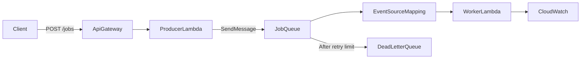

# Cost-Safe SQS-Triggered Lambda Learning Plan

Extend the native Lambda API with an asynchronous job path: an HTTP producer enqueues work in SQS and a worker Lambda processes it. Learn queue semantics, IAM, retries, partial batch failures, dead-letter queues, logs, metrics, Terraform, and GitHub Actions.

This plan builds on Plan 2. `POST /jobs` returns `202 Accepted` after enqueueing a job. The sample operation validates a message, transforms its input, and writes a structured result log without requiring a database.

Estimated effort: 8–14 focused hours.

## 1. Learn the asynchronous contract
- Define a versioned job envelope containing `jobId`, `operation`, `input`, `requestedAt`, and `schemaVersion`.
- Use a naturally repeatable transformation so duplicate delivery has no harmful external side effect.
- Understand that Standard SQS and Lambda event source mappings provide at-least-once processing: duplicates and out-of-order delivery are possible, and enqueue success does not mean processing success.

## 2. Add the producer endpoint
- Extend the native HTTP API with `POST /jobs`, validate the request, create a `jobId`, and send the versioned message to SQS.
- Return `202 Accepted` with the job ID rather than pretending the operation has completed.
- Give the producer Lambda role only `sqs:SendMessage` on the source queue.
- Emit JSON logs for accepted and rejected jobs without logging sensitive payloads.

## 3. Build the worker Lambda
- Implement a typed `SQSEvent` handler under `src/workers`.
- Parse each record, validate its schema, perform the transformation, and emit a structured completion log with `jobId`, message ID, receive count, duration, and result metadata.
- Keep configuration in standard-tier Parameter Store where useful and grant only the worker execution role access.
- Make the operation idempotent by design and document why in-memory duplicate tracking cannot provide durable idempotency across Lambda environments.

## 4. Configure retries, batching, and failure isolation
- Start with a small batch size and configure `ReportBatchItemFailures` so successful records are not retried when one record fails.
- Set queue visibility timeout to at least six times the worker timeout and configure a redrive policy with `maxReceiveCount` of at least five.
- Add a dead-letter queue and deliberately send a poison message to observe retries, receive counts, visibility timeout, and redrive.
- Redrive or delete the poison message manually after diagnosing it.

## 5. Inspect logs, metrics, and cost behavior
- Correlate producer logs, SQS message IDs, worker logs, Lambda request IDs, and DLQ entries.
- Inspect source/DLQ visible messages, messages in flight, age of oldest message, Lambda invocations/errors/duration/throttles, and API Gateway request/error/latency.
- Do not enable custom metrics, provisioned pollers, or Container Insights.
- SQS has no minimum fee, but an enabled Lambda event source mapping long-polls the queue and those SQS API requests are metered.
- Disable or destroy the mapping between labs for strict zero-idle usage. The SQS free tier covers the first one million requests monthly but does not guarantee a zero bill.

## 6. Deploy manually, then reproduce with Terraform
- Create the source queue, DLQ, redrive policy, producer and worker roles, worker function, event source mapping, log groups, and API route manually once.
- Rebuild them under `sqs-infra` using least-privilege IAM: producer send-only; worker receive/delete/get-attributes.
- Apply, send valid and poison jobs, inspect processing and redrive, disable the mapping, destroy the stack, and verify all resources are gone.

## 7. Extend GitHub Actions and complete the capstone
- Add worker tests using realistic batched SQS events, including all-success, partial-failure, malformed-message, and duplicate-delivery cases.
- Extend the OIDC-secured workflow to package and update both producer and worker functions.
- Run an asynchronous smoke test by sending a job and verifying processing through logs and queue state.
- Complete one deploy → enqueue → process → retry → DLQ → diagnose → redrive/delete → disable mapping → destroy cycle.
- Compare synchronous API handling with asynchronous processing: latency, coupling, retries, backpressure, delivery guarantees, failure visibility, and cost.

## Deferred follow-up
- DynamoDB-backed durable idempotency, FIFO queues, job-status storage, Step Functions, alarms, reserved concurrency tuning, event filtering, large-payload S3 patterns, cross-account queues, and advanced message encryption.

## References
- [Using Lambda with SQS](https://docs.aws.amazon.com/lambda/latest/dg/with-sqs.html)
- [SQS error handling and partial batches](https://docs.aws.amazon.com/lambda/latest/dg/services-sqs-errorhandling.html)
- [Configuring SQS event sources](https://docs.aws.amazon.com/lambda/latest/dg/services-sqs-configure.html)
- [SQS scaling behavior](https://docs.aws.amazon.com/lambda/latest/dg/services-sqs-scaling.html)
- [SQS pricing](https://aws.amazon.com/sqs/pricing/)
